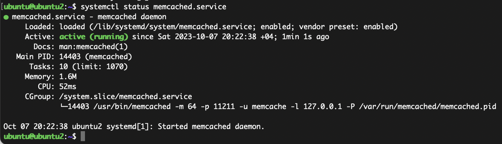
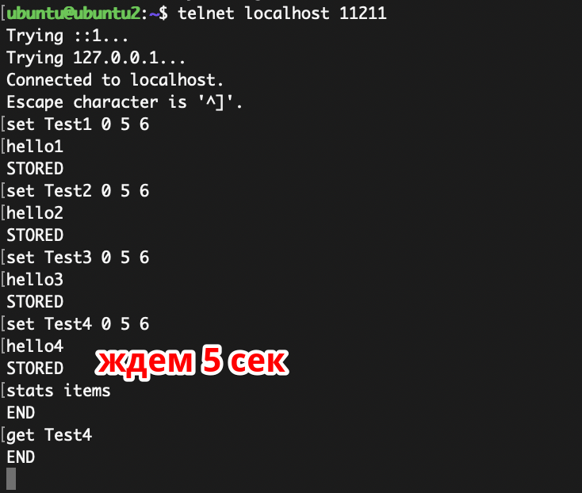
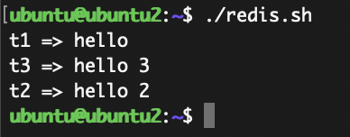
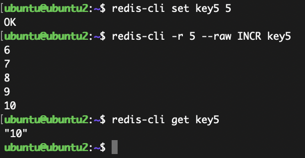

# Домашнее задание к занятию "`«Кеширование Redis/memcached`" - `Гущин Евгений`

### Задание 1

 - Улучшение производительности веб-сайтов (кеширование статики)
 - Снижение нагрузки на серверы
 - Улучшение производительности приложений
 - Снижение использования сетевых ресурсов
 - Поддержание доступности данных в оффлайн-режиме
 - Сокращение нагрузки на сторонние сервисы

---

### Задание 2



### Задание 3



### Задание 4

```bash
for key in $(redis-cli --scan)
do
        echo "$key => $(redis-cli get $key)"
done
```


### Задание 5


