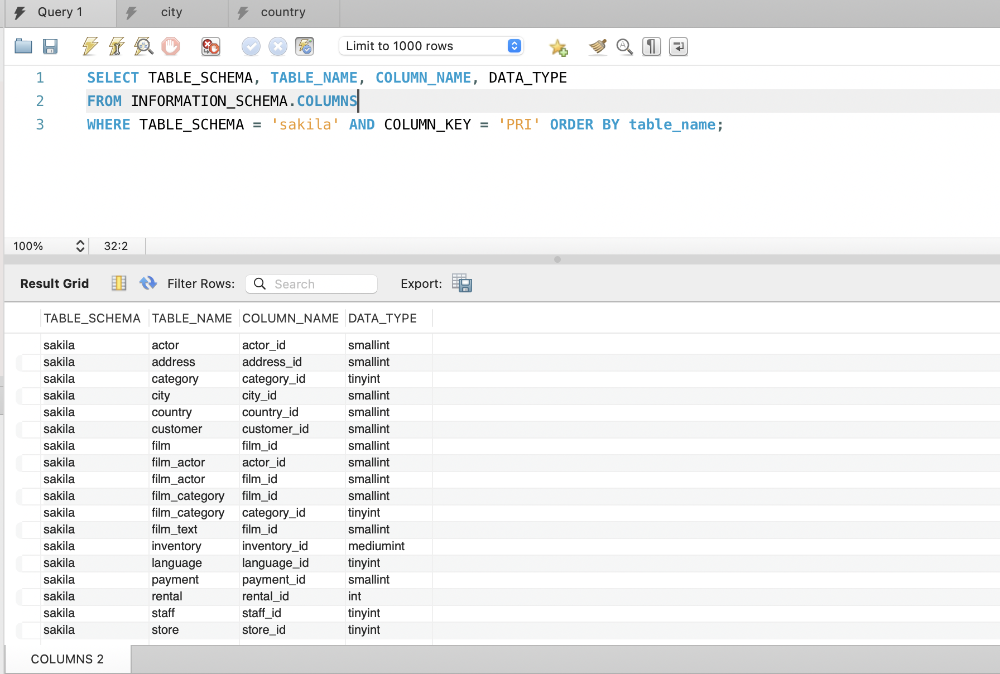

# Домашнее задание к занятию "`Базы данных`" - `Гущин Евгений`

### Задание 1

```sql
CREATE USER 'sys_temp'@'localhost' IDENTIFIED BY '123456';
SELECT user FROM mysql.user;
GRANT ALL PRIVILEGES ON *.* TO 'sys_temp'@'localhost' WITH GRANT OPTION;
SHOW GRANTS FOR 'sys_temp'@'host';
```

Dump восстановил через MySQLWorkbench


---

### Задание 2

```sql
SELECT TABLE_SCHEMA, TABLE_NAME, COLUMN_NAME, DATA_TYPE
FROM INFORMATION_SCHEMA.COLUMNS
WHERE TABLE_SCHEMA = 'sakila' AND COLUMN_KEY = 'PRI' ORDER BY table_name;
```


