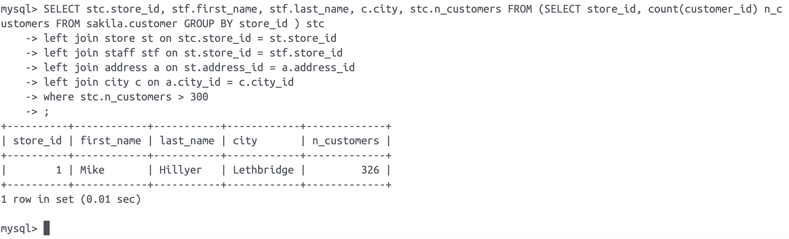
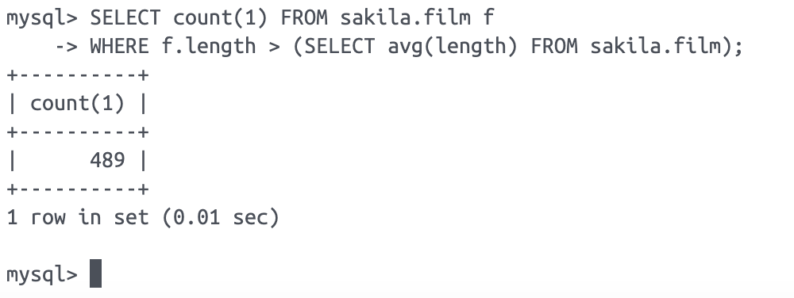
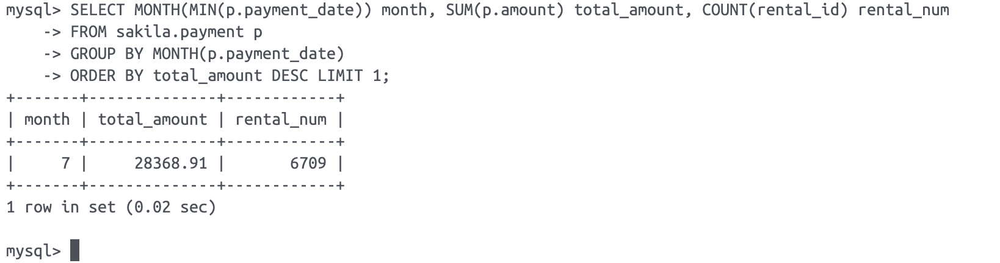
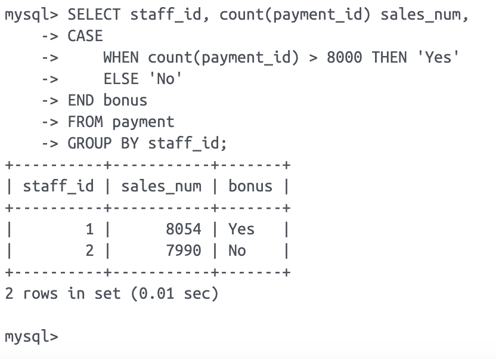
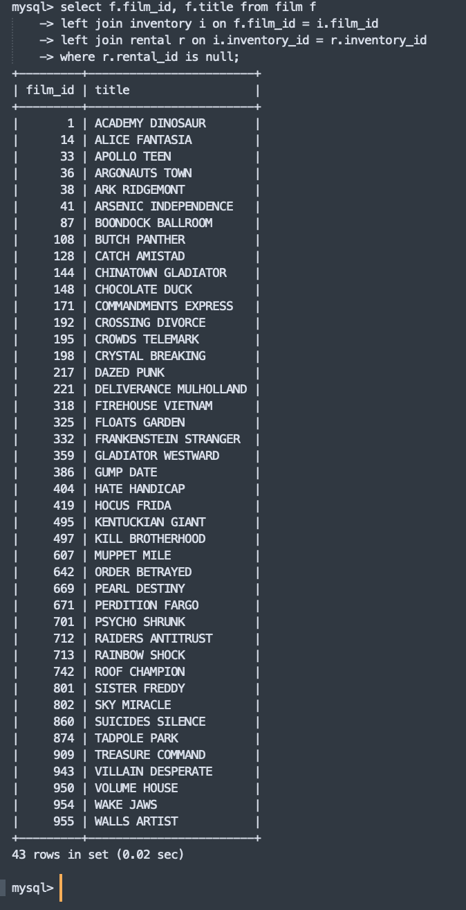

# Домашнее задание к занятию "`SQL. Часть 1`" - `Гущин Евгений`

### Задание 1



---

### Задание 2



---

### Задание 3



---

### Задание 4



---

### Задание 5

```sql
select f.film_id, f.title from film f
left join inventory i on f.film_id = i.film_id
left join rental r on i.inventory_id = r.inventory_id
where r.rental_id is null;
```


