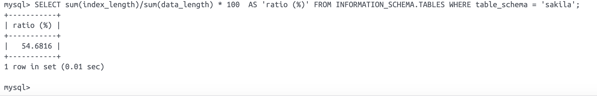
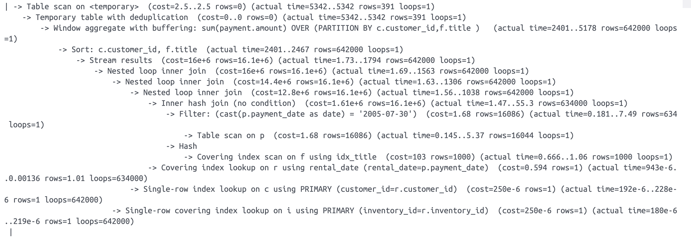
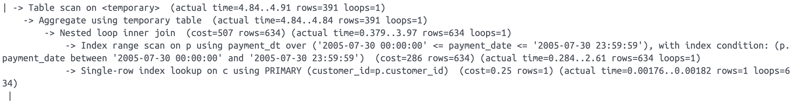

# Домашнее задание к занятию "`Индексы`" - `Гущин Евгений`

### Задание 1



---

### Задание 2




Честно говоря опыта чтения результатов анализа нет от слова совсем...
Но как мне показалось основные проблемы это:
 - много лишних джоинов
 - оконнная функция over (partition by)
 - нет индекса для основного фильтра (payment_date)

 А в последствии оказалось, что и функцию DATE() нельзя использовать в условии потому, что 
 MySQL в таком случае не использует индекс.

В итоге получился вот такой запро.

```sql
select concat(c.last_name, ' ', c.first_name) customer, sum(p.amount) total_amount
from payment p
join customer c on c.customer_id = p.customer_id
where p.payment_date BETWEEN '2005-07-30 00:00:00' AND '2005-07-30 23:59:59'
group by p.customer_id;
```

