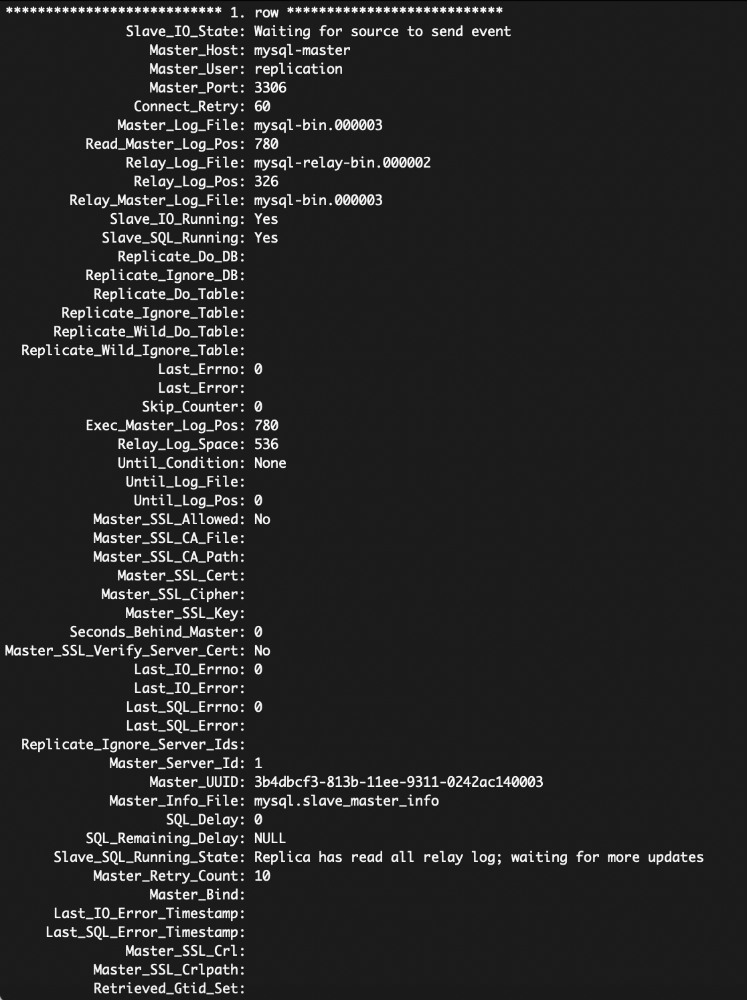
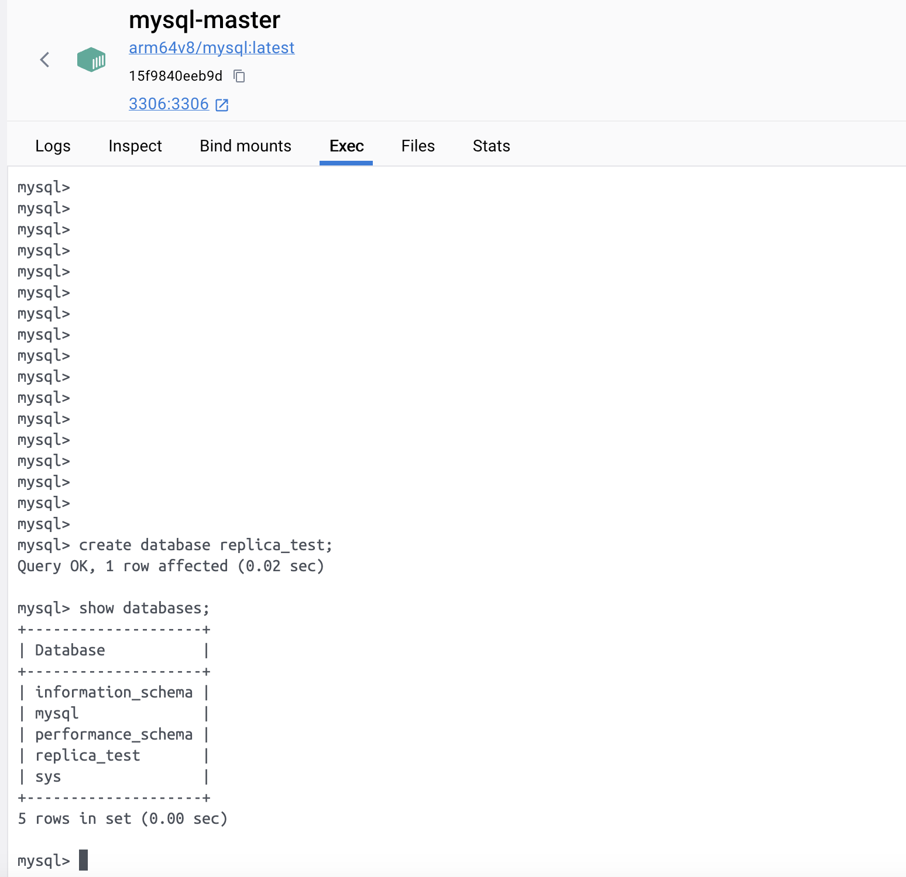
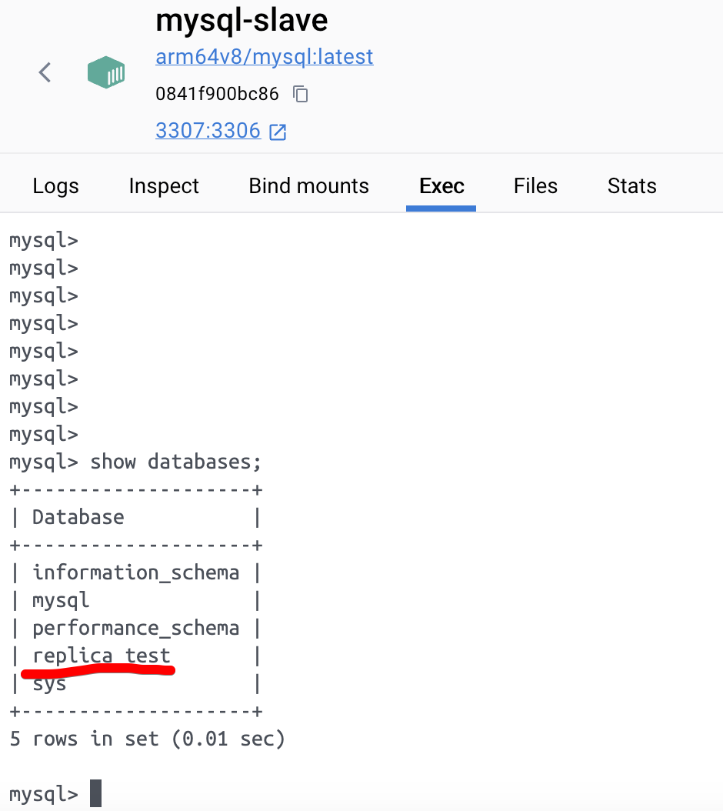
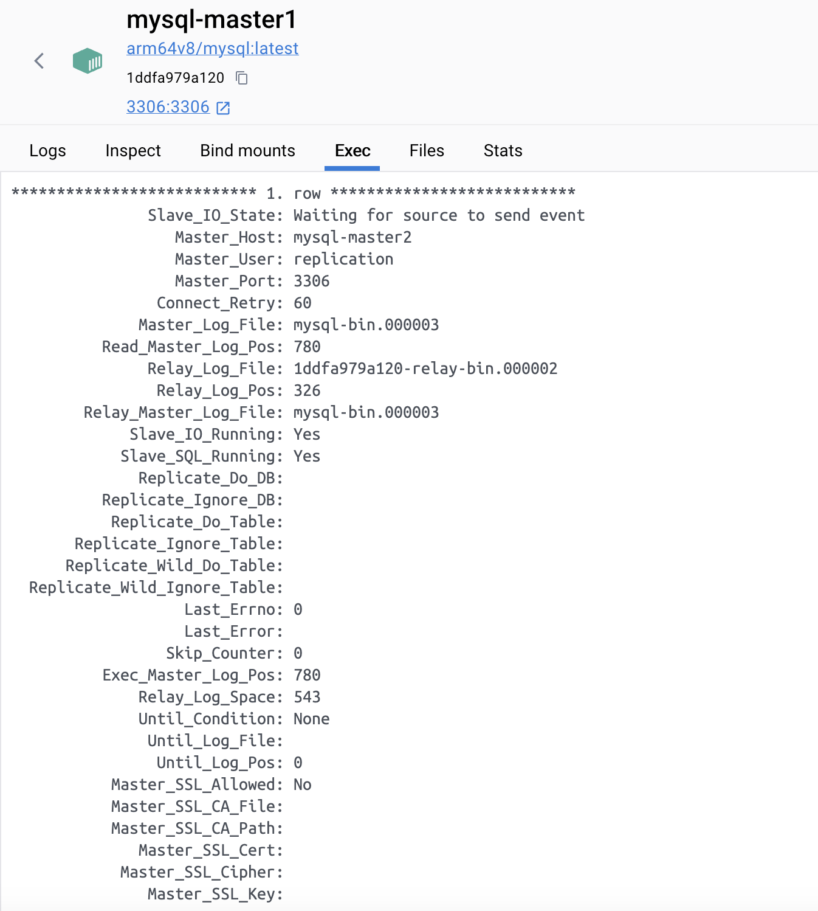
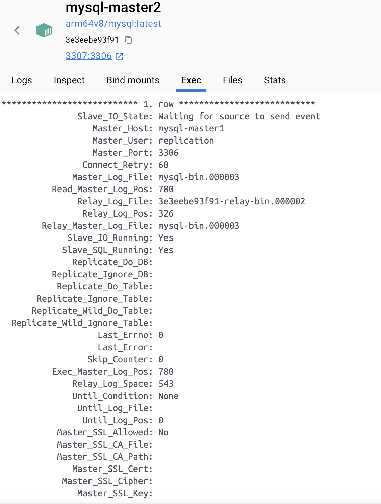
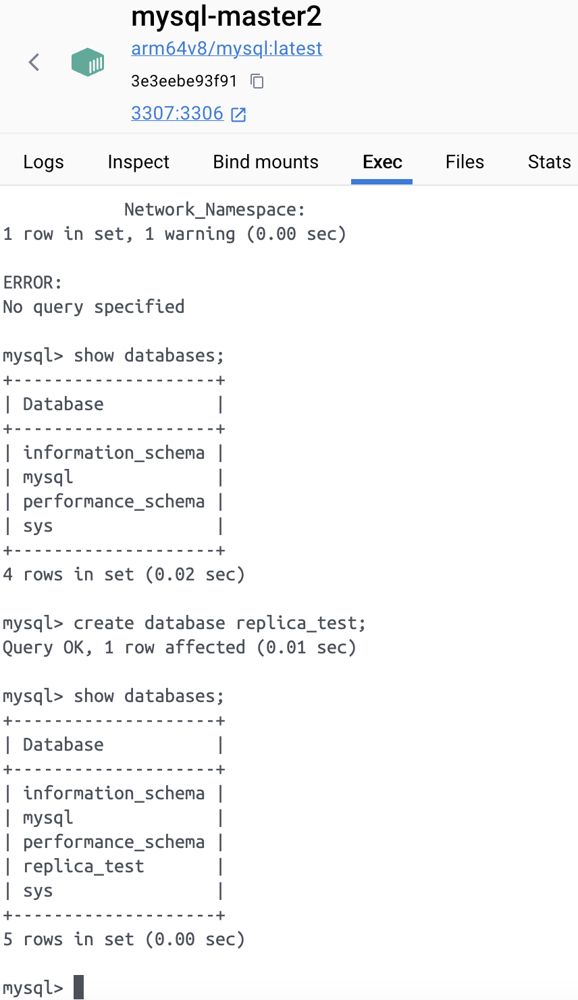
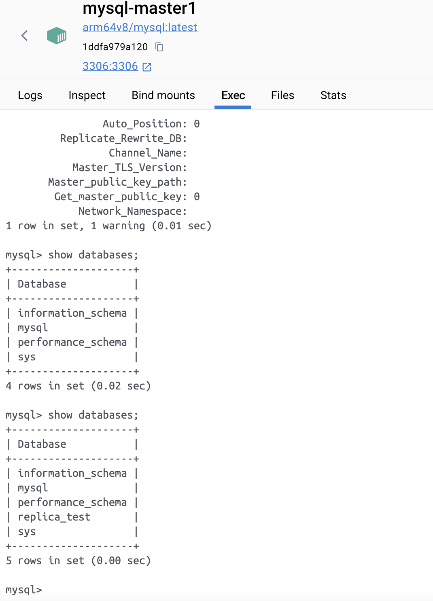

# Домашнее задание к занятию "`Репликация и масштабирование. Часть 1`" - `Гущин Евгений`

### Задание 1

Оснонвные различия между способами репликации master-slave и master-master заключаются в том, что:
    master-slave:
        - сущетсвую slave ноды, которые используются только для чтения
        - все изменения идут только через master ноду
        - увеличение производительности для операций чтения
        - при отключении master ноды потребуется вмешательство администратора
    master-master
        - все узлы могут принимать как операции записи, так и операции чтения
        - лучше отказоустойчивость потому, что при отключении одной мастер ноды, мы всегда можем продолжить работу через другую ноду
        - увеличение производительности для операций чтения не происходит

---

### Задание 2

[master.cnf](./replica1/master/master.cnf)
[slave.cnf](./replica1/slave/slave.cnf)

---

### Задание 3

[master1.cnf](./replica1/master/master1.cnf)
[master2.cnf](./replica1/master/master2.cnf)

