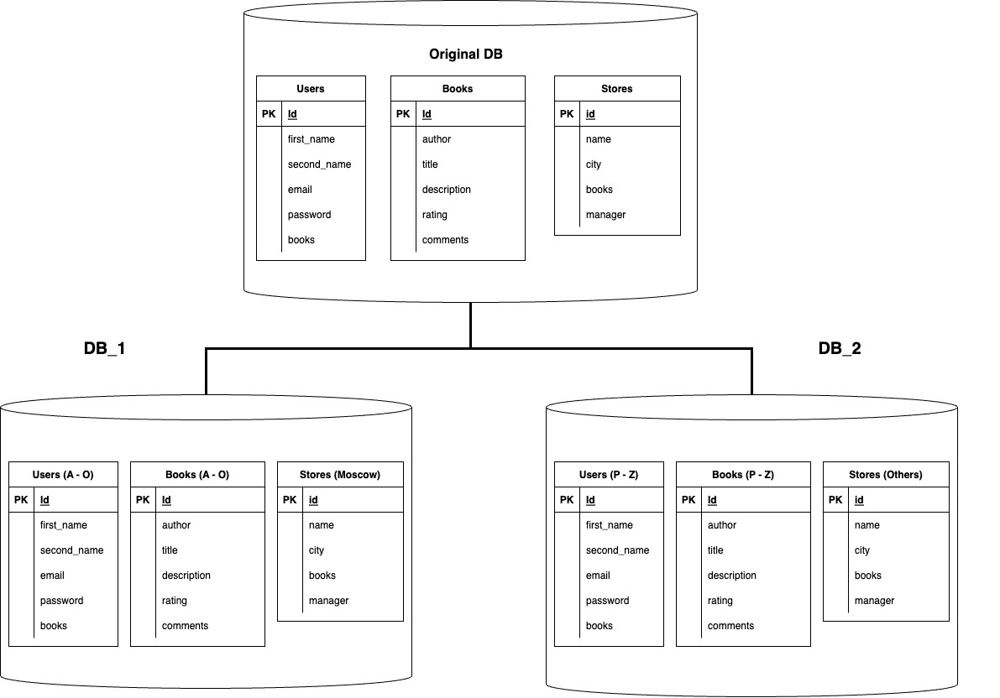

# Домашнее задание к занятию "`Репликация и масштабирование. Часть 2`" - `Гущин Евгений`

### Задание 1

Опишите основные преимущества использования масштабирования методами:
##### Активный master-сервер и пассивный репликационный slave-сервер:
- повышение отказоустойчивости
- увеличение производительности для операций чтения

##### Master-сервер и несколько slave-серверов:
- повышение отказоустойчивости
- увеличение производительности для операций чтения
- возможность балансировки нагрузки между slave нодами

##### активный сервер со специальным механизмом репликации — distributed replicated block device (DRBD):
- отказоустойчивость и надежность данных
- прозрачность для приложений
- быстрое восстановление после сбоев
- синхронная и асинхронная репликация

##### SAN-кластер:
- высокая доступность
- легкость в масштабировании
- гибкость в конфигурации
- обеспечение высокой производительности

---

### Задание 2

Вертикальное шардирование предполагает разделение данных по столбцам. В этом случае каждый шард содержит часть столбцов массива и все связанные с ними строки данных. Вертикальное шардирование может быть полезно, когда некоторые столбцы используются чаще, а другие — реже.

Горизонтальное шардирование подразумевает разделение хранилища на сгруппированные по каким-либо критериям строки. В этом случае каждый шард содержит одинаковые столбцы, но разные строки данных. Горизонтальное шардирование позволяет распределить нагрузку на запись и чтение данных между различными серверами, за каждый из которых отвечает отдельная машина.

В нашем случае шардирование может выполнятся следующим образом:

#### Users
##### Вертикальное
В одну базу данных мы можем сохранять данные о покупках пользователя, а во второй хранить личную информацию пользователя
##### Горизонтальное
Горизонтально пользователей можно разделить, например по алфавитным интервалам фамилий

#### Books
##### Вертикальное
В одну базу данных мы можем сохранять данные о рейтинге и комментариях к книге, а во второй хранить общую информацию о книге
##### Горизонтальное
Горизонтально книги можно разделить, например по алфавитным интервалам фамилий авторов

#### Stores
##### Вертикальное
В одну базу данных мы можем сохранять общие данные (название, адрес и т.п) о магазине , а во второй хранить информацию о складских остатках и персонале
##### Горизонтальное
Горизонтально магазины можно разделить, например по регионам или городам

### Вертикальное


### Горизонтальное


---

### Задание 3

[Docker](./sharding/docker-compose.yml)

Настройка для одной таблицы **Shops**

Подключаем экстенсшн.
Заводим удаленный сервер и маппинг для пользователя

```sql
CREATE EXTENSION postgres_fdw;
CREATE SERVER db_2_server FOREIGN DATA WRAPPER postgres_fdw OPTIONS (host '172.21.10.12', port '5432', dbname 'testdb');
CREATE USER MAPPING FOR postgres SERVER db_2_server OPTIONS (user 'postgres', password '12345');
```
Создаем удаленную таблицу **shops_other**
```sql
CREATE FOREIGN TABLE shops_other ( 
        id      INTEGER NOT NULL, 
        NAME    CHARACTER VARYING(50) NOT NULL, 
        city_id SMALLINT NOT NULL  
)
SERVER db_2_server
OPTIONS (schema_name 'public', table_name 'shops');
```

Создаем таблицу **shops_1**
```sql
CREATE TABLE 
    shops_1
    ( 
        id      INTEGER NOT NULL, 
        NAME    CHARACTER VARYING(50) NOT NULL, 
        city_id SMALLINT NOT NULL, 
        PRIMARY KEY (id) 
    );
```
В качестве основной таблице используем VIEW
```sql
CREATE VIEW shops AS
	SELECT * FROM shops_1
		UNION ALL
	SELECT * FROM shops_other;
```
Создаем основное правило, которое будет срабатывать, если ни одна проверка не сработала
```sql
CREATE RULE shops_insert AS ON INSERT TO shops
DO INSTEAD NOTHING;
CREATE RULE shops_update AS ON UPDATE TO shops
DO INSTEAD NOTHING;
CREATE RULE shops_delete AS ON DELETE TO shops
DO INSTEAD NOTHING;
```
Создаем правила для записи в зависимости от Id города
```sql
CREATE RULE shops_insert_1 AS ON INSERT TO shops
	WHERE (city_id = 1)
DO INSTEAD INSERT INTO shops_1 VALUES (NEW.*);

CREATE RULE shops_insert_other AS ON INSERT TO shops
	WHERE (city_id != 1)
DO INSTEAD INSERT INTO shops_other VALUES (NEW.*);
```
остальные правила создаются по аналогии

для проверки сделаем INSERT
```sql
INSERT INTO shops
(id, name, city_id)
VALUES
(1, 'Shop1', 1),
(2, 'Shop2', 1),
(3, 'Shop3', 2),
(4, 'Shop4', 3);
```

Результат


