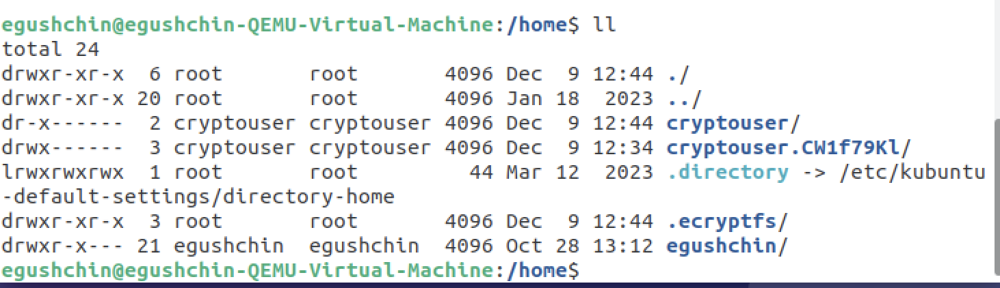

# Домашнее задание к занятию "`Уязвимости и атаки на информационные системы`" - `Гущин Евгений`

### Задание 1

Установить Metasploitable2 на ARM процессоре не получилось
Установить Metasploitable2 на ВМ в Яндекс облаке тоже не получается
Поэто сканировал обычную ВМ с Ubuntu

Уязвимость нашел только одну
https://www.exploit-db.com/exploits/46024

---

### Задание 2

При сканировании используется разный набор протоколов

-sv: TCP, ICMPv6, SIP, HTTP, SSLv3
-sS: TCP, ARP
-sf, -sX: ARP
-sU: ARP, UDP, ICMP
