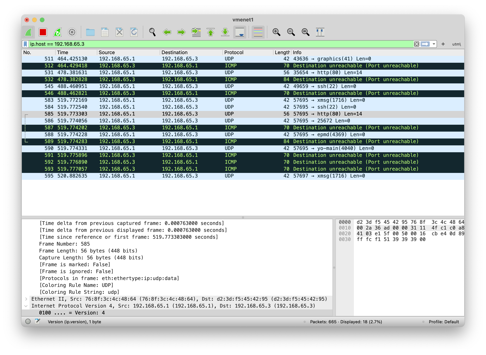

# Домашнее задание к занятию "`Уязвимости и атаки на информационные системы`" - `Гущин Евгений`

### Задание 1

Установить Metasploitable2 на ARM процессоре не получилось  
Установить Metasploitable2 на ВМ в Яндекс облаке тоже не получается  
Поэто сканировал обычную ВМ с Ubuntu  
  

Уязвимость нашел только одну
https://www.exploit-db.com/exploits/46024

---

### Задание 2

-sS:   
При SYN сканировании отправляются пакеты с установленным флагом SYN. Если порт открыт, сервер отвечает пакетом с установленными флагами SYN и ACK. Если порт закрыт, то сервер отвечает пакетом с установленным флагом RST.  

-sF:  
Wireshark -ом  ничего вразумаительного поймать не удалось.  
Но Гугл говорит, что:  
При FIN сканировании отправляются пакеты с установленным флагом FIN. Если порт закрыт, сервер отвечает RST пакетом. Если открыт, то не отвечает.  
  
-sX:  
Устанавливаются FIN, PSH и URG флаги. Если порт закрыт, сервер отвечает RST пакетом. Если открыт, то не отвечает.  

-sU:  
Посылается UDP пакет. ICMP ошибка говорит о том, что порт закрыт или фильтруется. Если ответа нет, то порт помечается как открыт|фильтруется

