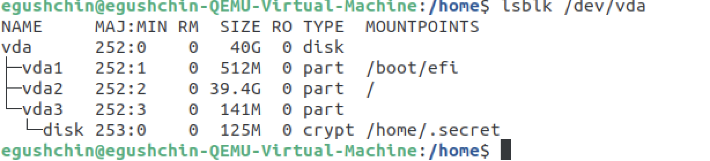
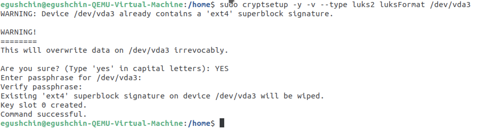
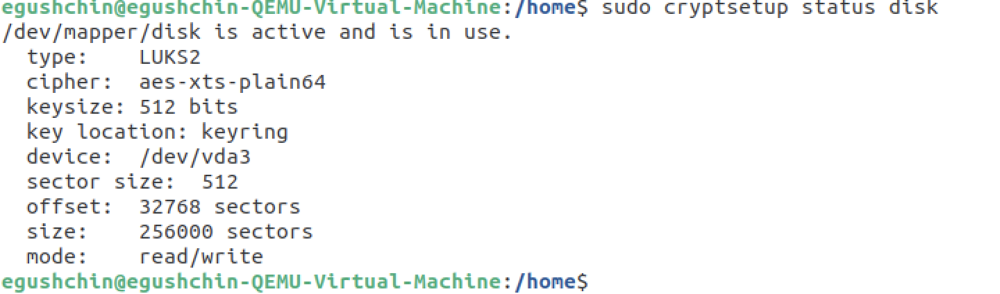

# Домашнее задание к занятию "`Защита сети`" - `Гущин Евгений`

### Задание 1

  
nmap обнаружил ssh сервис, nginx сервер, сервер печати  
  
  
сканирования *nmap* определяются как потенциальные/подозрительные попытки сканирования   

  
Fail2ban никак особо не отреагировал

---

### Задание 2

  
Suricata определяет попытку подбора пароля как скан SSH   

  
Fail2Ban банит атакующую машину  
  

