# Домашнее задание к занятию "`Оркестрация группой Docker контейнеров на примере Docker Compose.`" - `Гущин Евгений`

### Задание 1

https://hub.docker.com/repository/docker/egushchin55/custom-nginx/general

---

### Задание 2

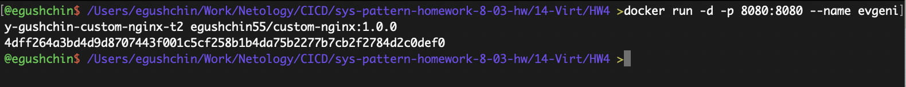 
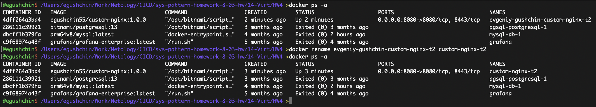  
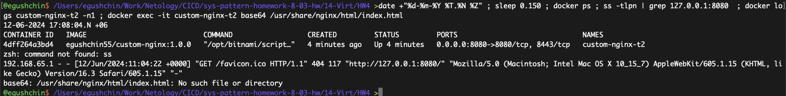  

---

### Задание 3

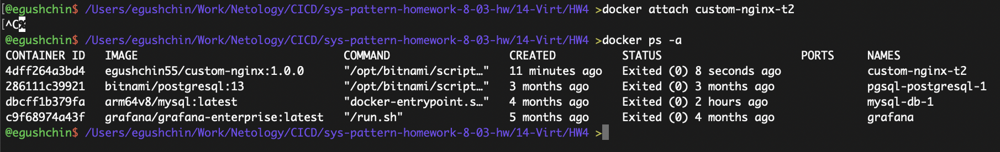  
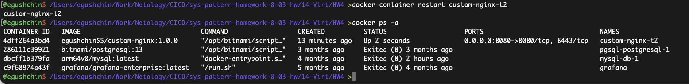  
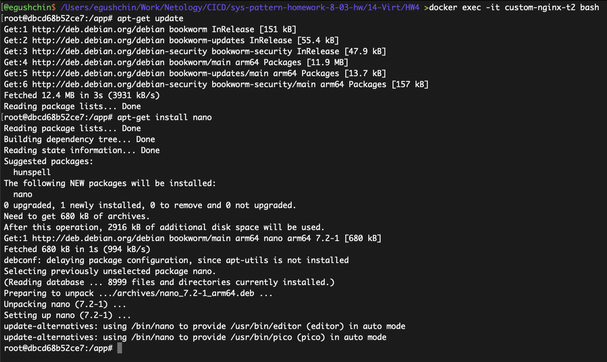  
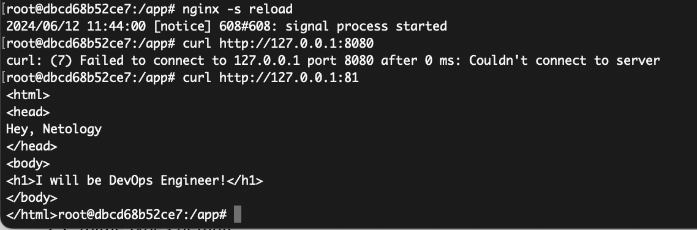  
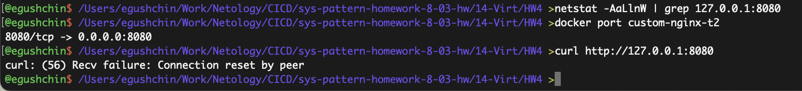  
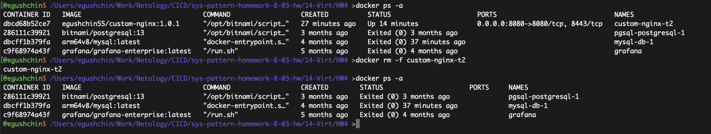  

---

### Задание 4

С запуском centos и debian на Маке с М1 чипом возникли трудности пожтому воспользовался образом из первого задания

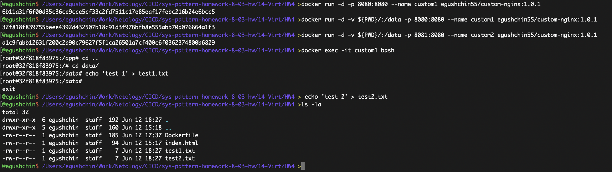  
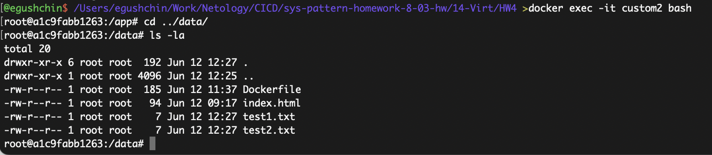  

---

### Задание 5

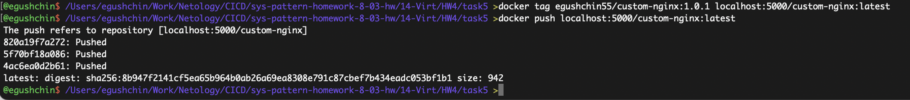  
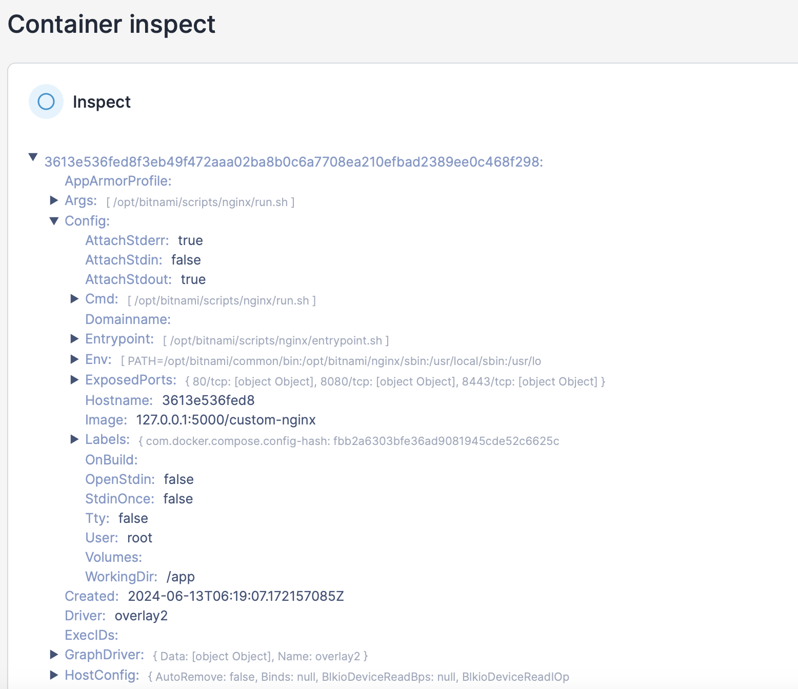  
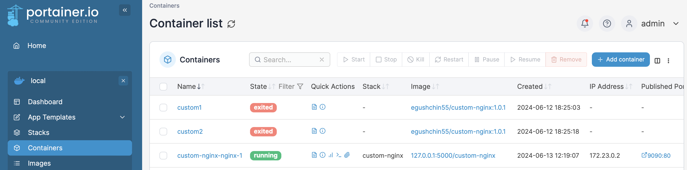  
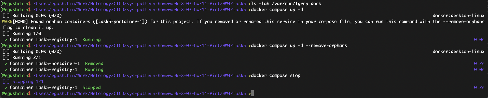  

При удалении одного compose файла, связанный с ним контейнер при выполнении команды `docker compose up -d` помечается как orphan(сирота) и предлагается удалить такой контейнер выполнив команду с ключом `--remove-orphans`
