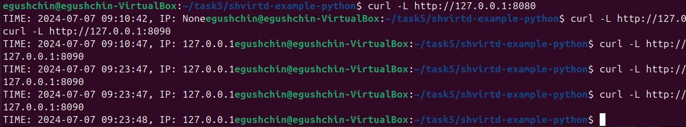
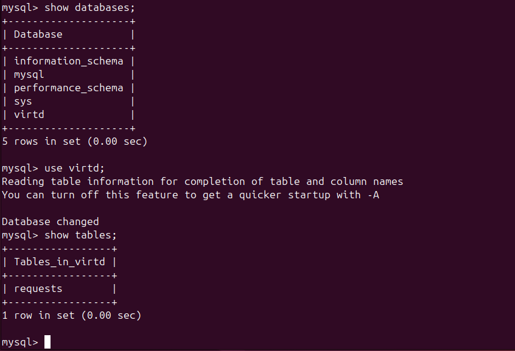
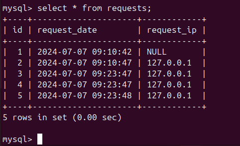
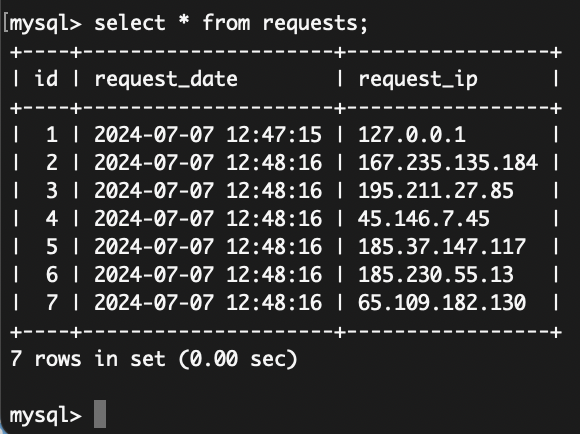
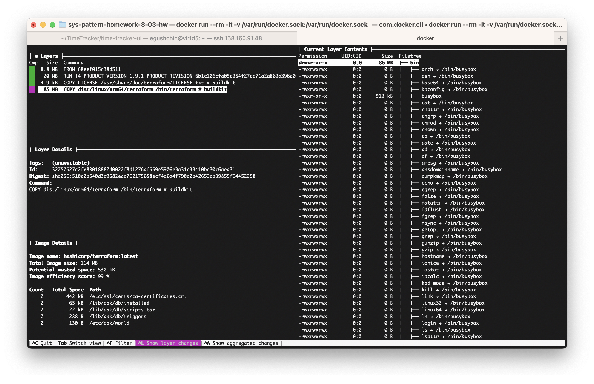
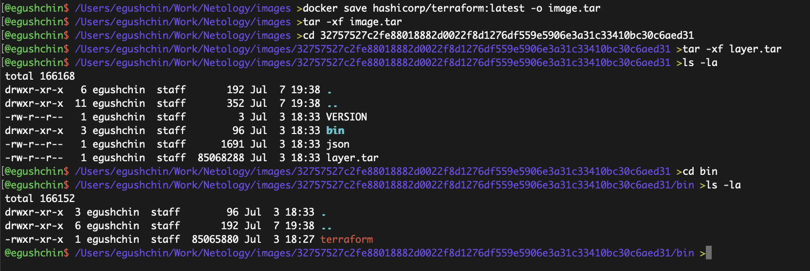
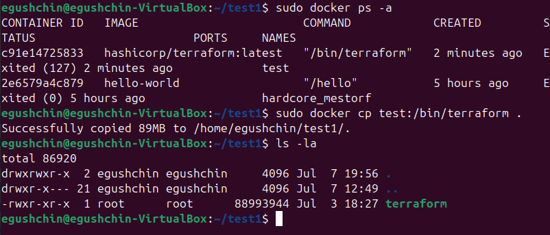

# Домашнее задание к занятию "`Практическое применение Docker`" - `Гущин Евгений`

### Задание 1

1. Сделал форк https://github.com/EvgeniyGushchin/shvirtd-example-python.git
2. Добавил Dockerfile.python и .dockerignore

---

### Задание 3

2. [compose.yaml](https://github.com/EvgeniyGushchin/shvirtd-example-python/blob/main/compose.yaml)

  
  
  

---

### Задание 4

1. скрипт [start.sh](https://github.com/EvgeniyGushchin/sys-pattern-homework-8-03-hw/blob/main/14-Virt/HW5/start.sh)
2. форк https://github.com/EvgeniyGushchin/shvirtd-example-python.git

  


---

### Задание 6

`docker run -rm -it -v /var/run/docker.sock:/var/run/docker.sock wagoodman/dive:latest hashicorp/terraform:latest`

 
 

---

### Задание 6.1

```bash
docker run --name test hashicorp/terraform:latest
docker cp test:/bin/terraform .
```

 


