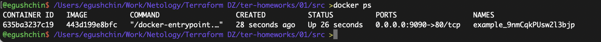
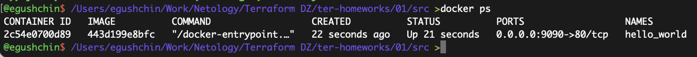
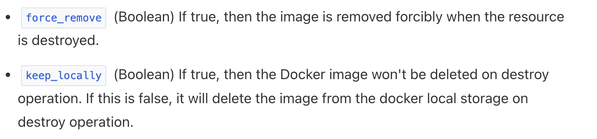
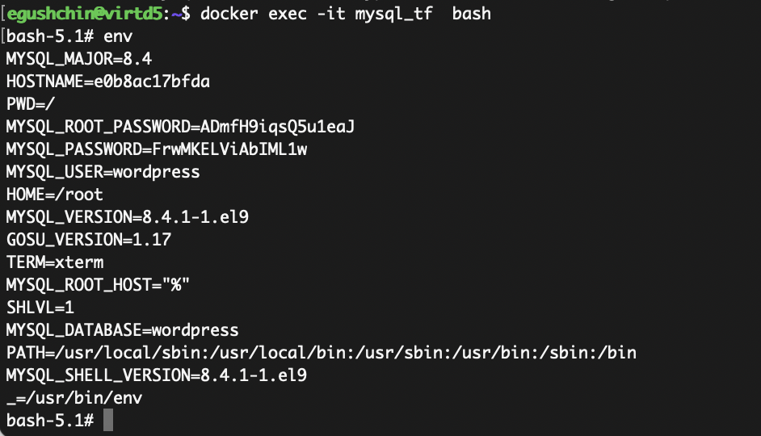

# Домашнее задание к занятию "`Введение в Terraform`" - `Гущин Евгений`

### Задание 1

2. personal.auto.tfvars
3. "result": "9nmCqkPUsw2l3bjp"
4. 
	4.1 все блоки `resource` должны иметь две метки. Не хватает метки
	4.2 имена могут начинаться только с буквы или с символа `_`. Имя `1nginx` недопустимое
	4.3 `random_password.random_string_FAKE.resulT` - нет такого ресурса `random_string_FAKE`
5.
```tf
resource "docker_image" "nginx" {
  name         = "nginx:latest"
  keep_locally = true
}

resource "docker_container" "nginx" {
  image = docker_image.nginx.image_id
  name  = "example_${random_password.random_string.result}"

  ports {
    internal = 80
    external = 9090
  }
}
```
  

6. `auto-approve` позволяет убрать интерактивные вопросы, связанные с подтверждением действий. Может быть удобно (возможно) при тестировании или при создании первоначальной схемы интфраструктуры (чтобы каждый раз не вбивать `yes`), возможно необходимо если terraform apply вызывается из каких-то скриптов автоматизации. Опция опасна тем, что нет последнего шанса проверить наши изменения. Существует риск все поломать.

  

7. Использовал команду - `terraform destroy`
```tf
{
  "version": 4,
  "terraform_version": "1.9.2",
  "serial": 11,
  "lineage": "a0c9a1c4-d656-07c7-bdc6-fa678a45eb6a",
  "outputs": {},
  "resources": [],
  "check_results": null
}
```

8.


Образ не удаляется птому, что `keep_locally = true` 
Чтобы образ удалялся надо поменять значение с `true` на `false` или использовать `force_remove`

---


### Задание 2



[main.tf](./main.tf)

