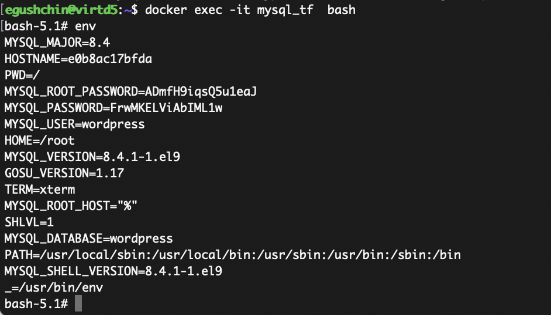

# Домашнее задание к занятию "`Основы Terraform. Yandex Cloud`" - `Гущин Евгений`

### Задание 1

Ошибки:
- `standart-v4` не существует. Поменял на `standard-v2`
- `cores = 1` значение должно быть 2 или больше для `standard-v2`

  
  

6. `preemptible = true` - Прерываемые виртуальные машины более дешевые и останавливаются через 24 часа, что для обучения более выгодно. Остановка через 24 часа поможет сэкномить деньги, если забыл остановить виртуалку в ручную.

`core_fraction=5` - уровень производительности определяет долю вычислительного времени физических ядер, которую гарантирует vCPU. Более низкая производительность обходиться по меньшей цене.

---

### Задание 2

[main.tf](./main.tf)

