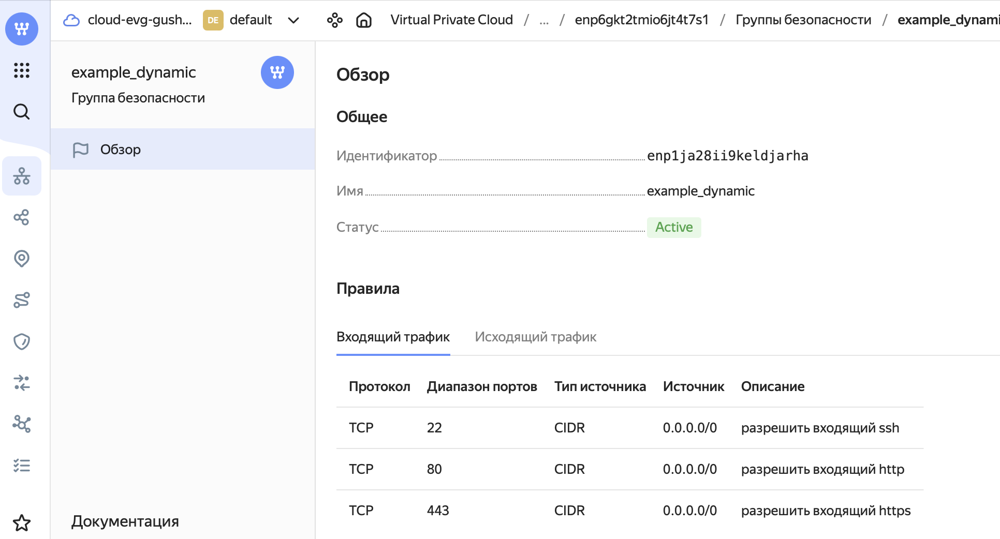
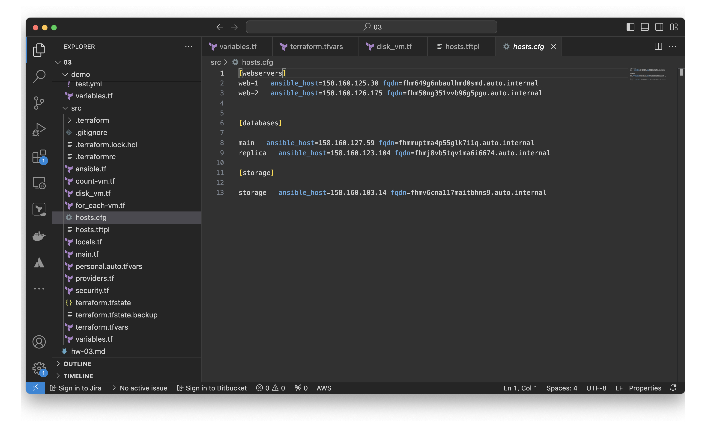
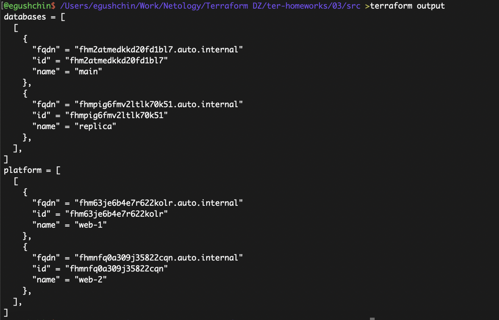

# Домашнее задание к занятию "`Управляющие конструкции в коде Terraform`" - `Гущин Евгений`

### Задание 1

  

---

### Задание 4

---

[Исходники здесь](./src/)

---

### Задание 5

---

### Задание 6

`Модифицируйте файл-шаблон hosts.tftpl`
Создал копию с модификацией `hosts2.tftpl`

[Исходники здесь](./src/)
