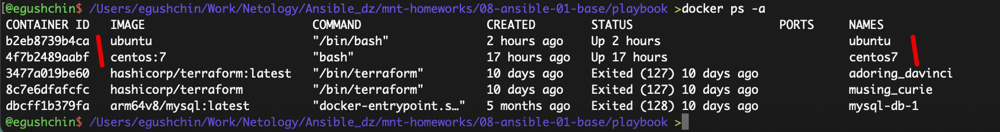
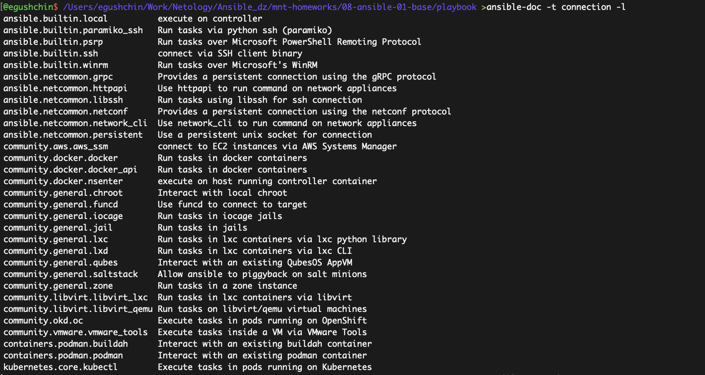

# Домашнее задание к занятию "`Введение в Ansible`" - `Гущин Евгений`

### Задание 1

1.   

`some_fact = 12`

2. Нашел переменную в `example.yml` и поменял это значение на "all default fact".

3.   

4.   

5. В group_vars поменял значение для deb — "deb default fact", для el — "el default fact"

6.   

7.   

8.   

9. выбрал `ansible.builtin.ssh`

 

10. В prod.yml добавил
```yml
local:
  hosts:
    localhost:
      ansible_connection: ssh
```

11. `ansible-playbook -i inventory/prod.yml site.yml --ask-vault-pass --ask-pass` 
 
---


[Playbook](./playbook)

