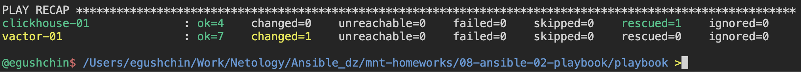

# Домашнее задание к занятию "`Работа с Playbook`" - `Гущин Евгений`

### Задание 1

1. Добавил в inventory-файл prod.yml публичные айпишники ВМ для ClickHouse и Vector.

2. В playbook site.yml поправил хосты в соответствии с prod.yml, нашел установку и настройку vector (https://github.com/dzervas/ansible-vector/tree/master), адаптировал код для наших задач.

3. При создании tasks из рекомендованных использовал модули get_url и template.

4. Переписал play на использование deb пакетов (использую Ubuntu)

5. Исправил ошибки
    

6. Запустил команду "ansible-playbook -i inventory/prod.yml site.yml --check", не мог увидеть скаченных файлов. (`--check` не применяет плейбук)

  

7. Запустил команду "ansible-playbook -i inventory/prod.yml site.yml --diff", получил результат.

  

8. Повторно запустил эту же команду, изменений не произошло.
  

9. [Readme](./playbook/README.md)

10. [Playbook](./playbook)

