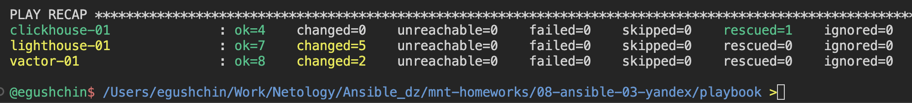

# Домашнее задание к занятию "`Использование Ansible`" - `Гущин Евгений`

### Задание 1

7. Запустил команду "ansible-playbook -i inventory/prod.yml site.yml --diff", получил результат.

  

8. Повторно запустил эту же команду, изменений не произошло.
  

9. [Readme](./playbook/README.md)

10. [Playbook](./playbook)

