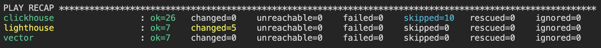

# Домашнее задание к занятию "`Работа с roles`" - `Гущин Евгений`

### Задание 1

1. Создал файл requirements.yml и добавил туда источник и версию скачивания роли для clickhouse.

2. При помощи команды "ansible-galaxy install -r requirements.yml -p roles" скачал роль в директорию "roles".

3. Создал новый каталог с названиями "vector-role" и "lighthouse-role" с помощью команд "ansible-galaxy role init vector-role" и "ansible-galaxy role init lighthouse-role" соответственно.

4. Заполнил новые роли, пустые директории удалил, разделил переменные между vars и default.

5. Шаблоны конфигов добавил в директорию templates.

6. Описал роли и их параметры в файлах README.md.

7. Перепроверил и убедился в правильности разнесенных команд и файлов.

8. Выложил роли в гитхаб. Добавил роли с названиями "vector" и "lighthouse" в файле requirements.yml.

9. Применил команду "ansible-playbook -i inventory/prod.yml site.yml" и убедился, что все работает.
   

10. playbook здесь [Playbook](./playbook)

11. Роль "vector-role": https://github.com/EvgeniyGushchin/vector-role  
  Роль "lighthouse-role": https://github.com/EvgeniyGushchin/lighthouse-role.git

