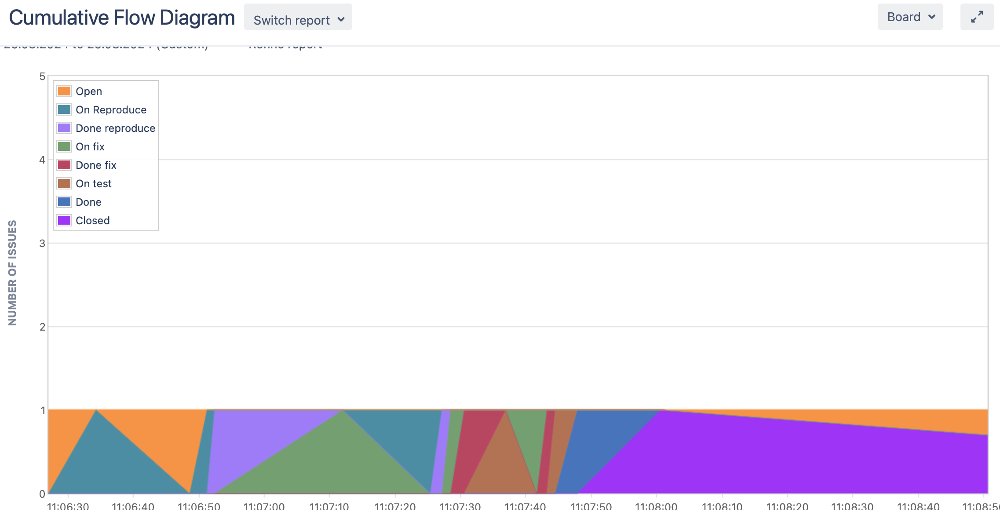
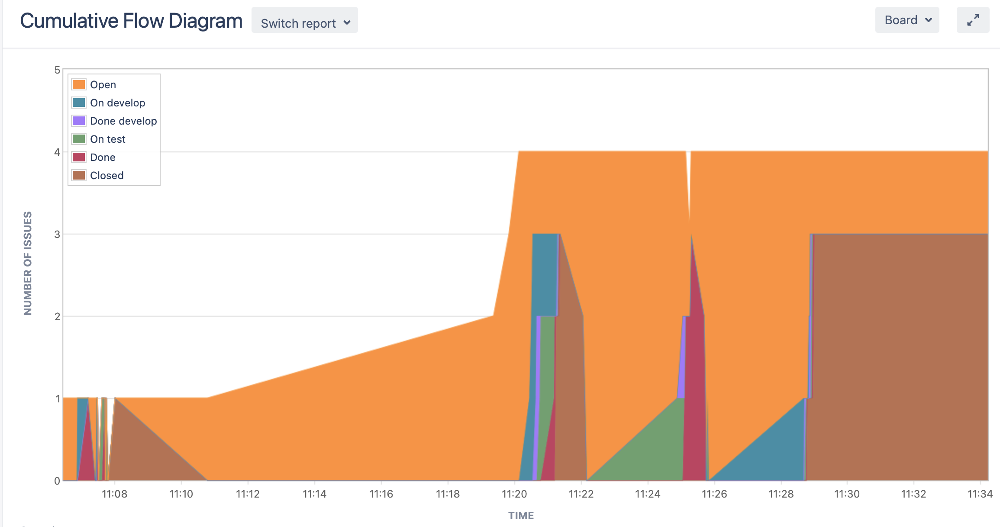
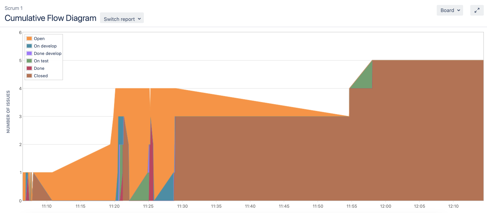
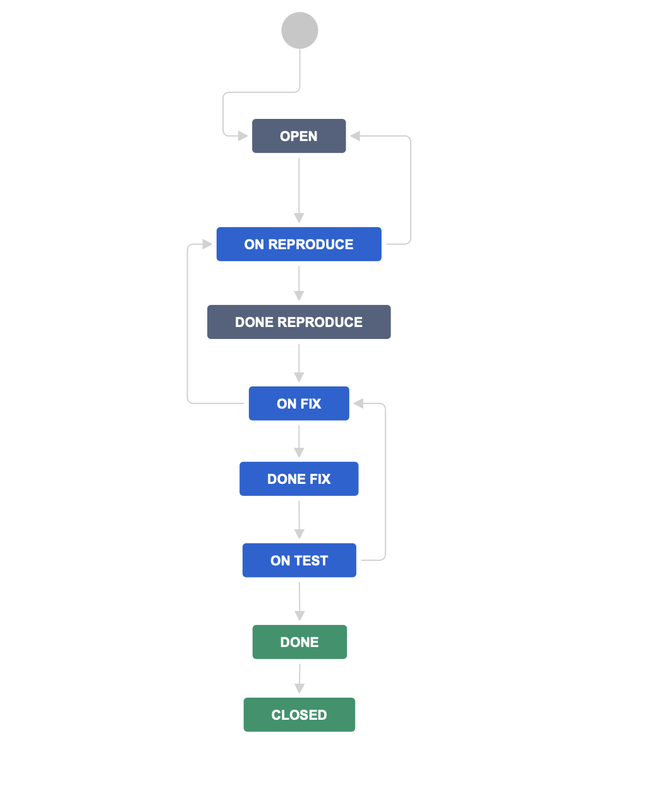
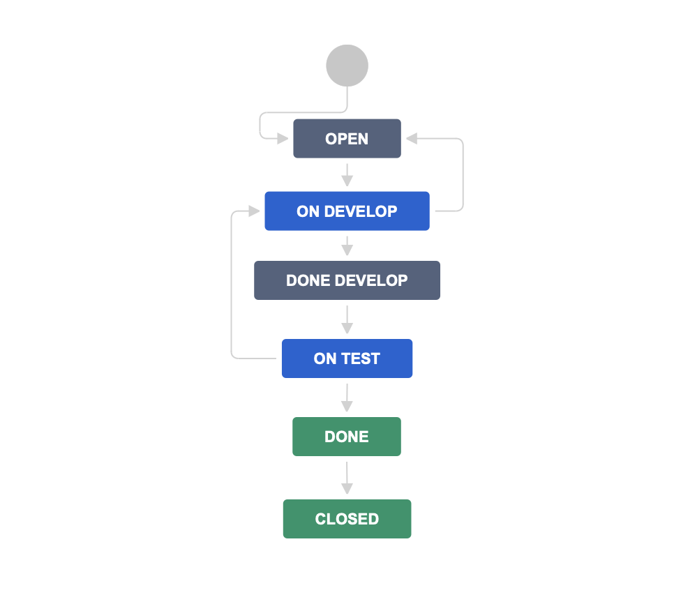

# Домашнее задание к занятию "`Жизненный цикл ПО`" - `Гущин Евгений`

### Задание 1

1. Поднял Jira в Докере.
2. Создал доски и задачи
3. Провел задачи по статусам
4. Для задачи типа `Bug`
  

5. Для задач остальных типов 
  

6. Провел задачи по всем статусам на Скрам доске
  

7. flow для багов [bugs.xml](./bugs.xml)
  

8. flow для остальных типов задач [tasks.xml](./tasks.xml)
  

