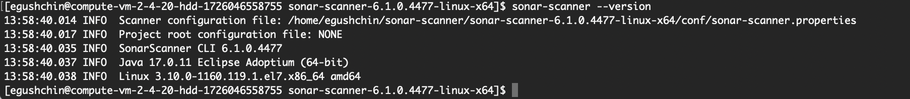
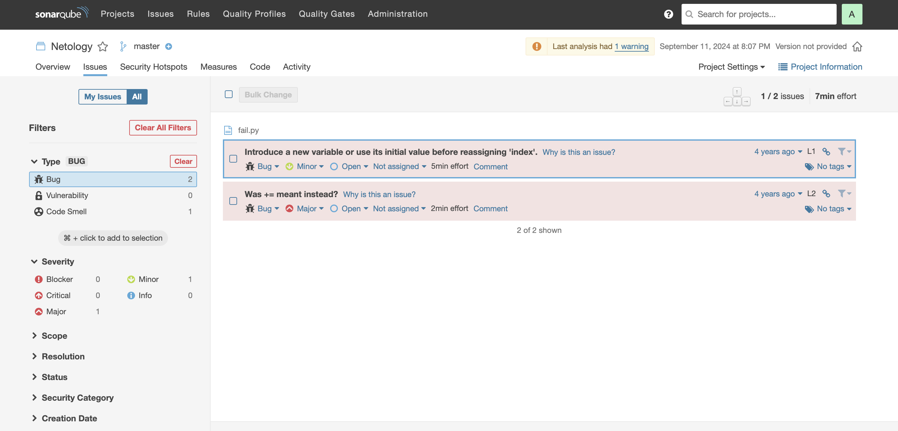
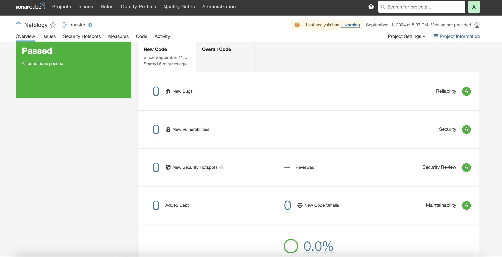
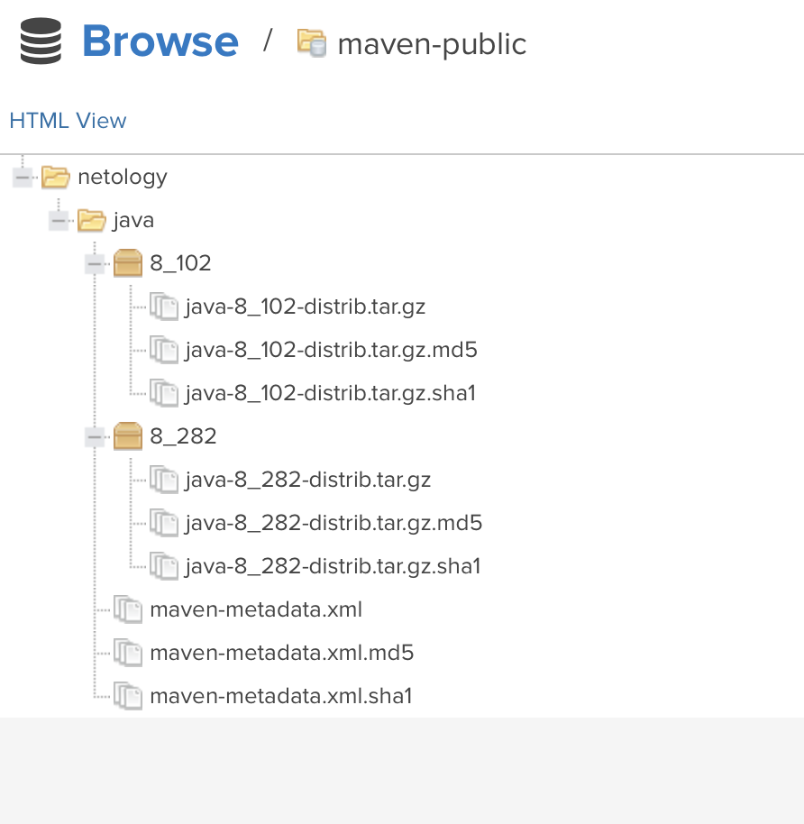
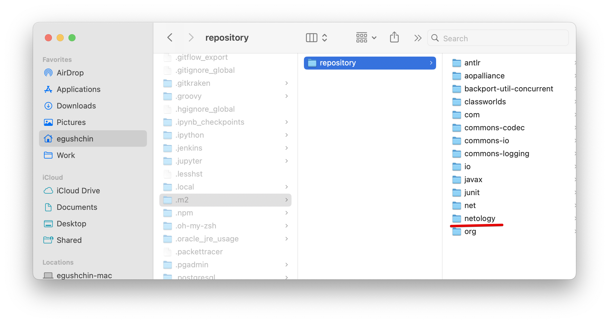

# Домашнее задание к занятию "`Процессы CI/CD`" - `Гущин Евгений`

### Задание 1

1. Установил `sonar-scanner`
  

2. Запустил анализатор
  

3. Исправил ошибки и запустил анализ повторно
  

### Задание 2

1. Загрузил артефакты
  

[maven-metadata.xml](./maven-metadata.xml)

### Задание 3

1. Установил и настроил `maven`
2. Запустил команду `mvn package`
3. Проверил директорию ~/.m2/repository/ и нашел артефакт с названием "netology".
  

4. [pom.xml](./pom.xml)

