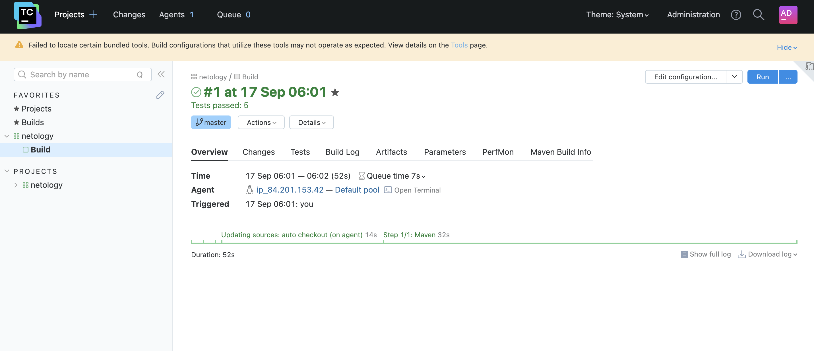
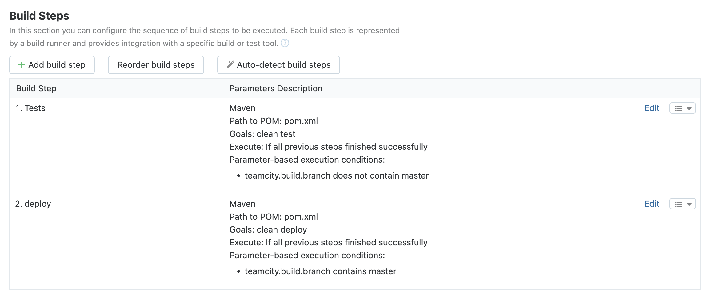
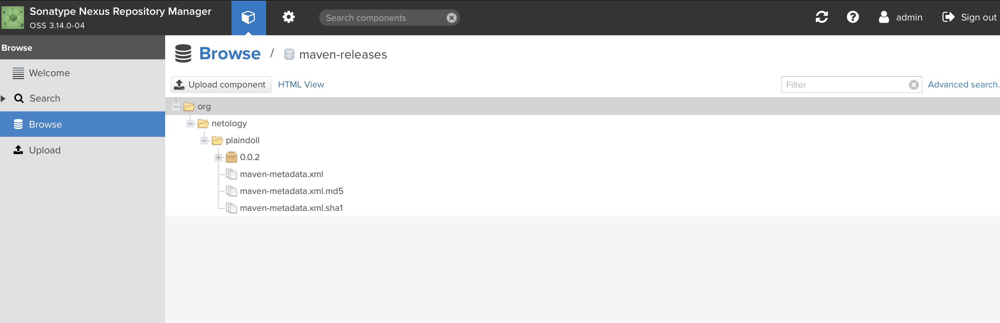
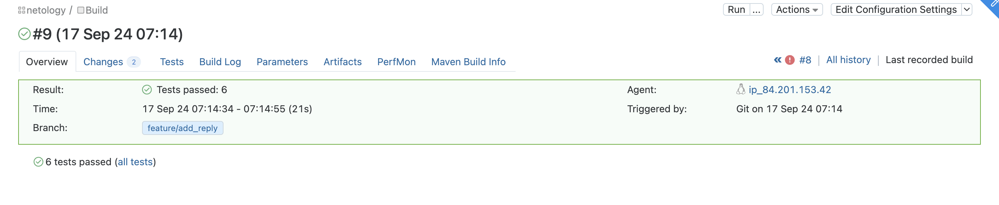
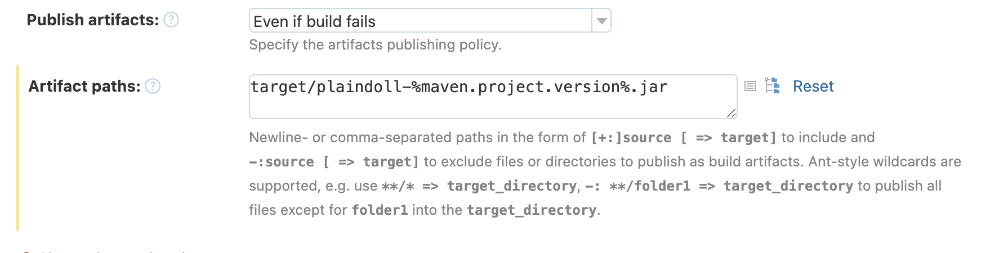

# Домашнее задание к занятию "`Teamcity`" - `Гущин Евгений`

### Задание 1

1. Сделал форк https://github.com/EvgeniyGushchin/example-teamcity/tree/master

2. Сделал autodetect конфигурации

3. Запустил сборку
  

4. Поменял условия сборки
  

5. Для deploy загрузил settings.xml в набор конфигураций maven у teamcity.

6. В pom.xml поменял ссылки на репозиторий и nexus.

7. Запустил сборку по master, убедился, что всё прошло успешно и артефакт появился в nexus:
  

8. Мигрировал build configuration в репозиторий.

9. Создал отдельную ветку feature/add_reply в репозитории.

10. Написал новый метод для класса Welcomer: метод должен возвращать произвольную реплику, содержащую слово hunter.

11. Сделал push всех изменений в новую ветку в репозиторий feature/add_reply.

12. Убедился, что сборка самостоятельно запустилась, тесты прошли успешно
  

13. Внес изменения из произвольной ветки feature/add_reply в master через PR.

14. Убедился, что нет собранного артефакта в сборке по ветке master.

15. Настроил конфигурацию так, чтобы она собирала .jar в артефакты сборки.
  

15. Проверил, что конфигурация в репозитории содержит все настройки конфигурации из teamcity.
