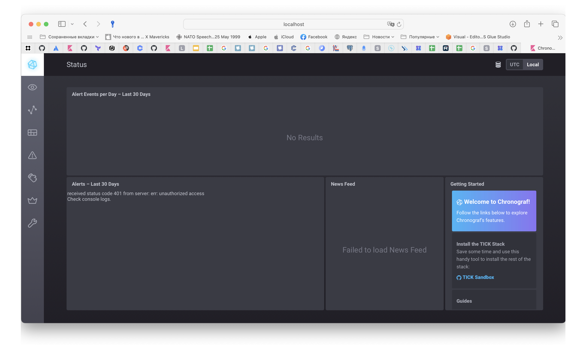
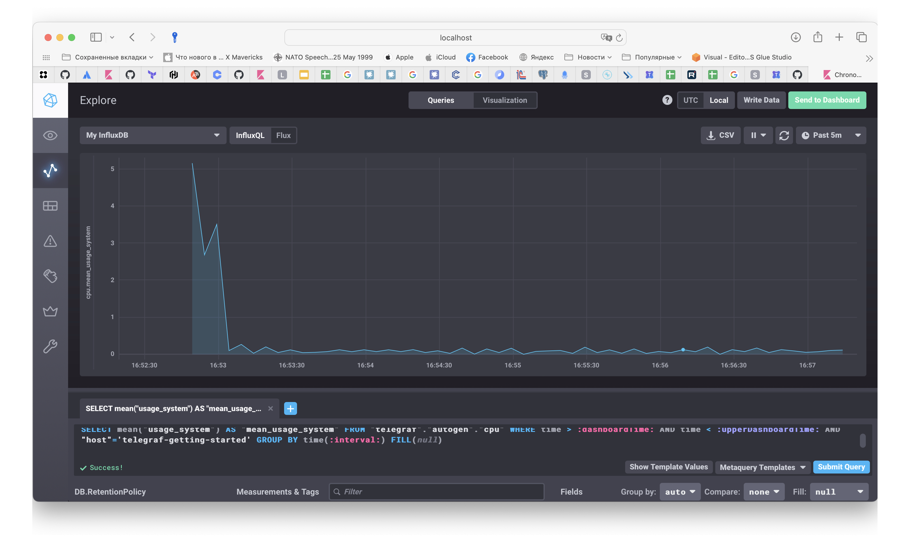
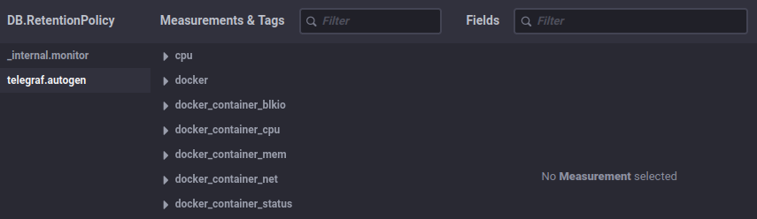

# Домашнее задание к занятию "`Введение в мониторинг`" - `Гущин Евгений`

### Задание 1

Вас пригласили настроить мониторинг на проект. На онбординге вам рассказали, что проект представляет из себя платформу для вычислений с выдачей текстовых отчётов, которые сохраняются на диск. Взаимодействие с платформой осуществляется по протоколу http. Также вам отметили, что вычисления загружают ЦПУ. Какой минимальный набор метрик вы выведите в мониторинг и почему?

1. загрузка CPU - так как вычисления загружают ЦПУ, нам надо контролировать этот параметр, чтобы вовремя заметить если мы уткнемся в потолок с текущей конфигурацией "железа"

2. свободное место на диске - так как отчеты сохраняются на диск, нам надо контролировать остаток свободного места, чтобы не потерять какой-то отчет в случае переполнения диска и отказе на запись

3. количество свободных inodes - так как мы сохраняем отчеты на диск в виде отдельных файлов

4. пинг HTTP сервера - для контроля доступности платформы

5. загрузка RAM - для контроля того, что имеющегося объема RAM хватает для функционирования платформы. При объемных вычислениях в RAM могут загружяться значительные по размеру данные

### Задание 2

Менеджер продукта, посмотрев на ваши метрики, сказал, что ему непонятно, что такое RAM/inodes/CPUla. Также он сказал, что хочет понимать, насколько мы выполняем свои обязанности перед клиентами и какое качество обслуживания. Что вы можете ему предложить?

*RAM* - оперативная память, влияет на производительность системы

*inodes* - индексный дескриптор, хранит информацию о файлах, при отсутствии свободных inodes система потеряет возможность создавать новые файлы 

*CPUla* - средняя загрузка процессора. Большие числа свидетельствуют о слишком большой нагрузке на сервер.

Дополнительно можно предложить следующие метрики:

- время отклика
- уровень ошибок
- время недостпности системы

### Задание 3

Вашей DevOps-команде в этом году не выделили финансирование на построение системы сбора логов. Разработчики, в свою очередь, хотят видеть все ошибки, которые выдают их приложения. Какое решение вы можете предпринять в этой ситуации, чтобы разработчики получали ошибки приложения?

Если ошибки могут быть обработаны на уровне приложения, то предложить разработчикам добавить в приложение новый сервис, который будет отправлять сообщения об ошибках в Telegram, Slack, email и т.д.
(тут может быть любой вариант, который позволит сохранить информацию об ошибках в доступном для разработчиков месте)

Если ошибки не могут быть обработаны на уровне приложения:

- на периодической основе в ручном режиме сбрасывать разработчикам логи накопленные системой 
- предоставить разработчикам доступ на чтение к среде где развернуто приложение и пусть сами смотрят системные логи

### Задание 4

Вы, как опытный SRE, сделали мониторинг, куда вывели отображения выполнения SLA = 99% по http-кодам ответов. Этот параметр вычисляется по формуле: summ_2xx_requests/summ_all_requests. Он не поднимается выше 70%, но при этом в вашей системе нет кодов ответа 5xx и 4xx. Где у вас ошибка?

Не учли 3хх ответы.

### Задание 5

Опишите основные плюсы и минусы pull и push систем мониторинга.

*pull-модель плюсы:*

- легче контролировать подлинность данных
- можно настроить единый proxy server до всех агентов с TLS
- упрощённая отладка получения данных с агентов 

*pull-модель минусы:*

- необходимо дополнительно настраивать узлы для мониторинга

*push-модель плюсы:*

- упрощение репликации данных в разные системы мониторинга или их резервные копии
- более гибкая настройка отправки пакетов данных с метриками
- использование UDP (экономим трафик)

*push-модель минусы:*

- необходимо настраивать агенты
- UDP не гарантирует доставку данных

### Задание 6

- Prometheus - pull-модель
- TICK - push-модель
- Zabbix - гибридная модель
- VictoriaMetrics - гибридная модель
- Nagios - push-модель

### Задание 7

  

### Задание 8

В веб-интерфейсе Chronograf создал график usage_system в поле cpu.

  

### Задание 9

Добавил плагин docker в конфигурацию telegraf.

  

### Задание 10

Написал скрипт [my_log.py](./my_log.py)

Добавил в cron задачу `sudo crontab -e`
`*/5 * * * * python3 /home/ubuntu/my_log.py >/dev/null 2>&1`

для тестирования запускал каждую минуту
`* * * * * python3 /home/ubuntu/my_log.py >/dev/null 2>&1`

результат [24-10-07-awesome-monitoring.log](./24-10-07-awesome-monitoring.log)