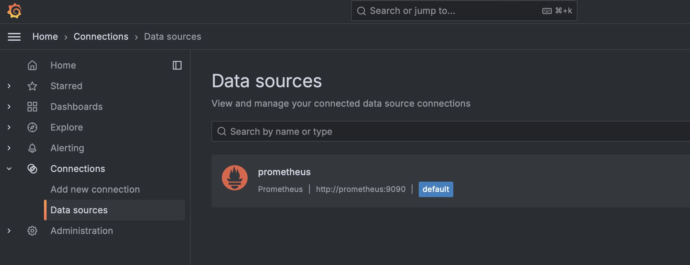
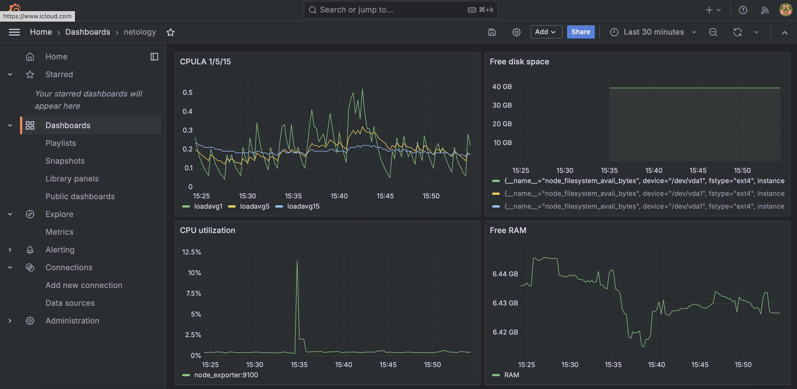
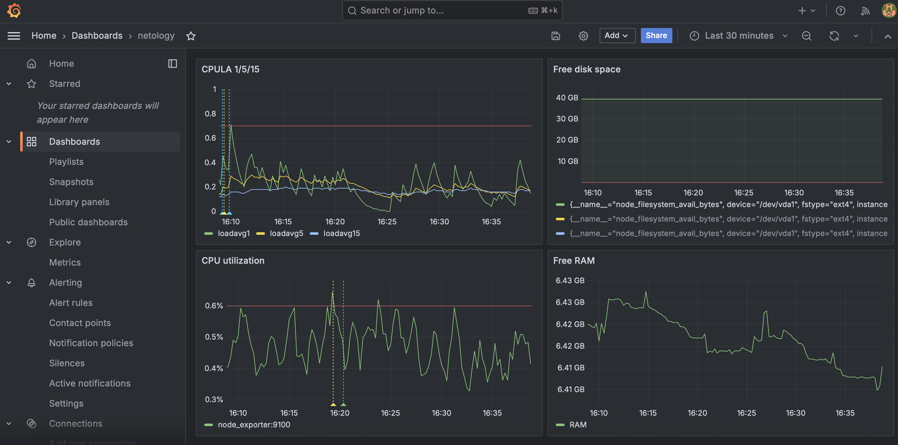

# Домашнее задание к занятию "`Средство визуализации Grafana`" - `Гущин Евгений`

### Задание 1

  

### Задание 2

| утилизация CPU для nodeexporter (в процентах, 100-idle) | 100 - (avg by (instance) (rate(node_cpu_seconds_total{job="node",mode="idle"}[1m])) * 100) |
| CPULA 1/5/15 | node_load1, node_load5, node_load15 |
| количество свободной оперативной памяти | node_memory_MemFree_bytes |
| количество места на файловой системе | node_filesystem_avail_bytes{fstype!='tmpfs'} |

  

### Задание 3

  

### Задание 4

[dashboard.json](./dashboard.json)

