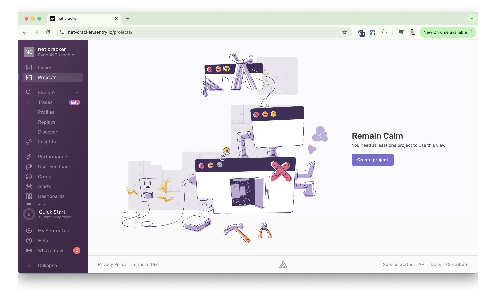
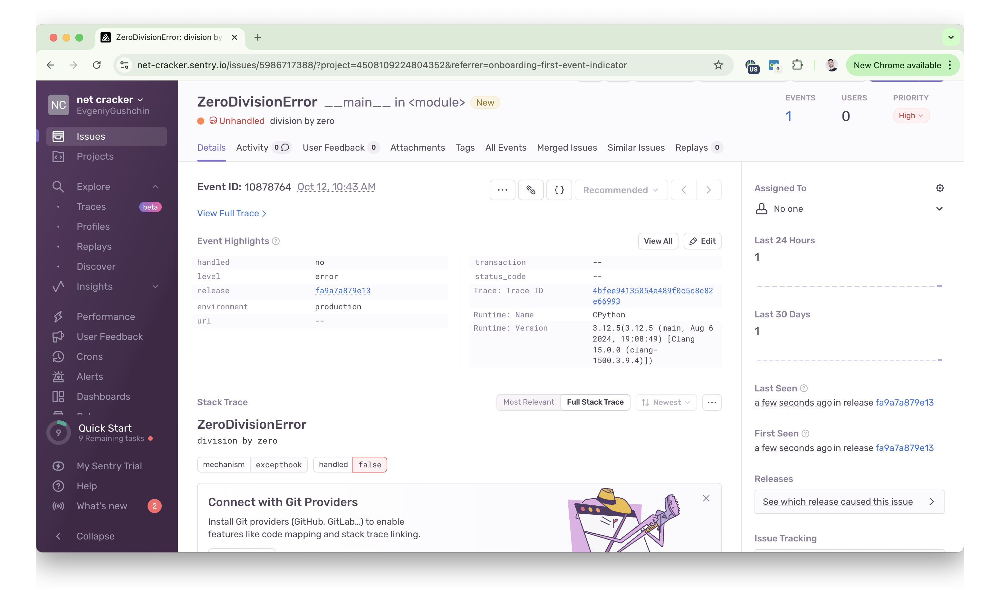
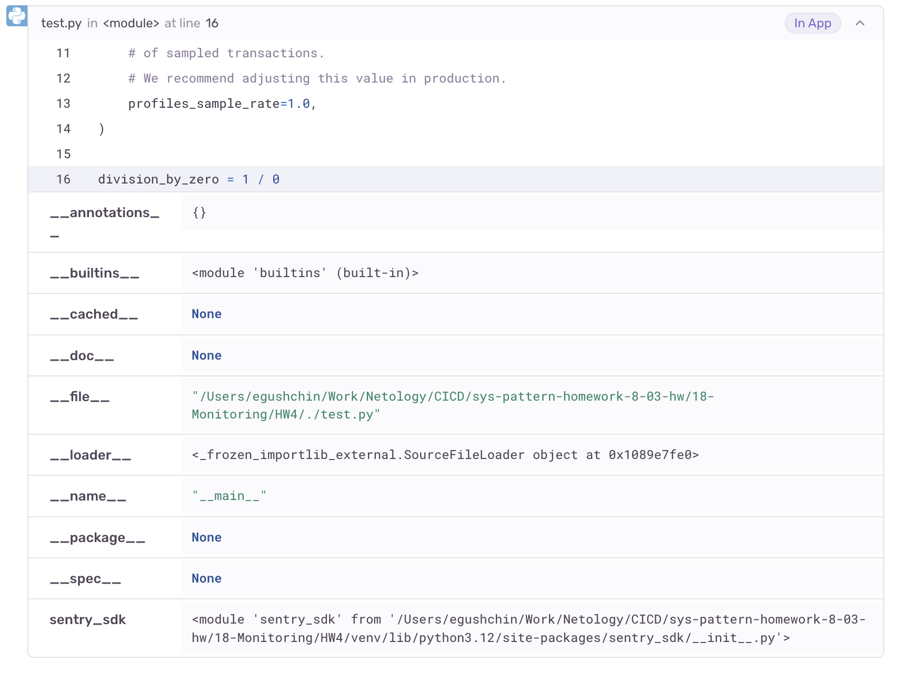
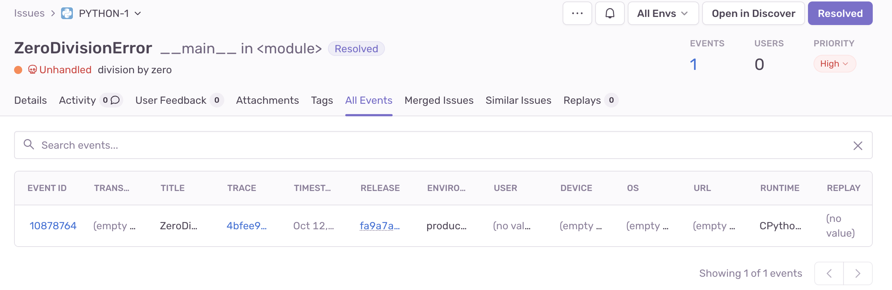
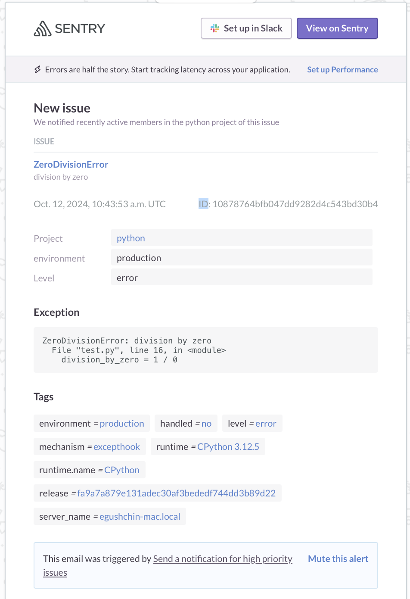

# Домашнее задание к занятию "`Платформа мониторинга Sentry`" - `Гущин Евгений`

### Задание 1

  

### Задание 2

`Generate sample event` для генерации тестового события не нашел. Пришлось на питоне с делением на ноль делать мини скрипт.

  
  
  

### Задание 3

  

