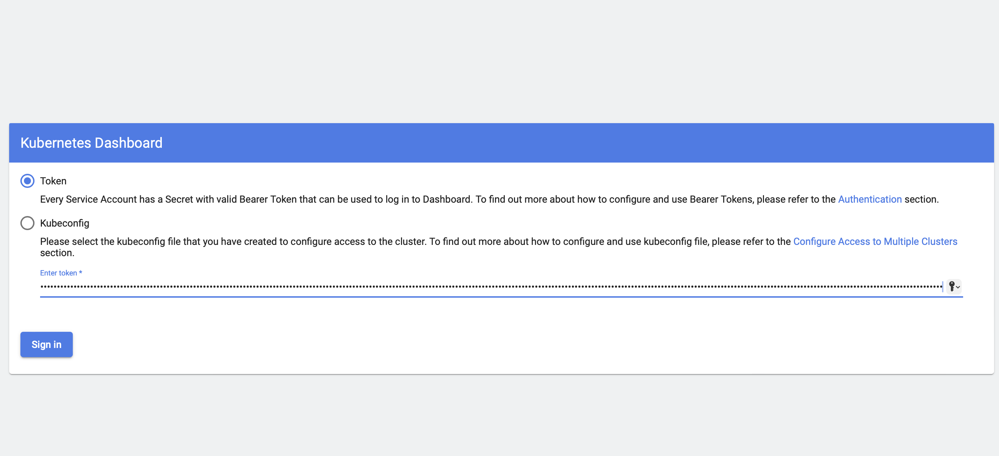

# Домашнее задание к занятию "`Kubernetes. Причины появления. Команда kubectl`" - `Гущин Евгений`

### Задание 1

1. Установил MicroK8S на ВМ в облаке
  

2. Запустил команду "microk8s status --wait-ready", увидел статус MicroK8S, доступные и подключенные addons.
  

3. Установил dashboard
  

4. Добавил ip-адрес в файле `/var/snap/microk8s/current/certs/csr.conf.template`
  

5. Обновил сертификаты
  

### Задание 2

1. Установил на локальную машину kubectl
  

2. Настроил подключение к кластеру
   

4. Пробросил порты
  

5. Подключился к дашборду
  

  

  
