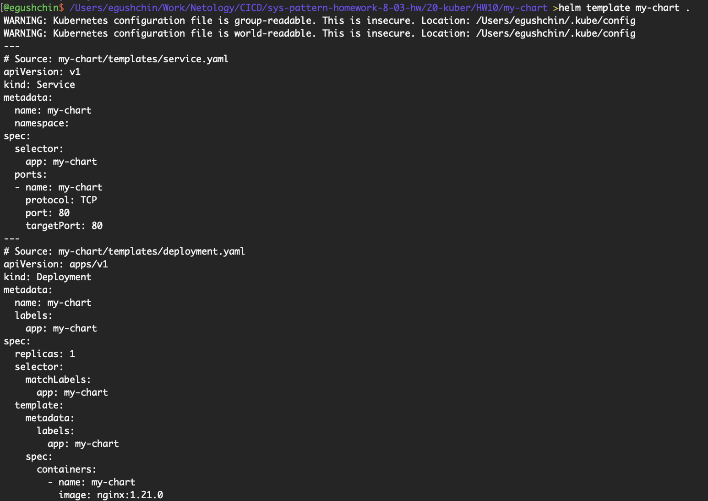
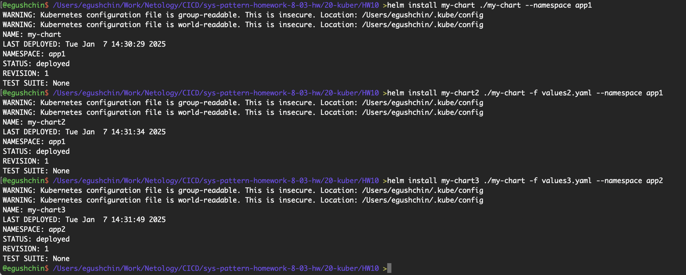

# Домашнее задание к занятию "`Helm`" - `Гущин Евгений`

### Задание 1

1. Создал Chart [Chart.yaml](./my-chart/Chart.yaml)
2. Создал:
- Deployment [deployment.yaml](./my-chart/templates/deployment.yaml)
- Service [service.yaml](./my-chart/templates/service.yaml)

3. Создал 3 версии Values:
- [values.yaml](./my-chart/values.yaml)
- [values2.yaml](./values2.yaml)
- [values3.yaml](./values3.yaml)

4. Проверил Chart 

### Задание 2

1. Создал необходимые namespaces

2. Установил чарты

3. Проверил, что чарты стартовали

3. Проверил, что работают деплойменты и поды

