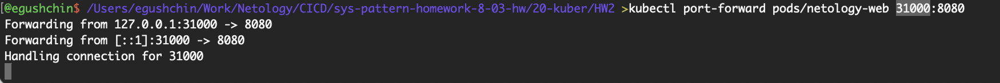
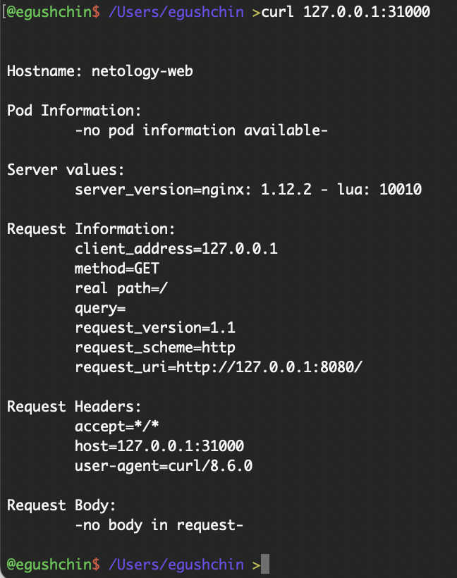
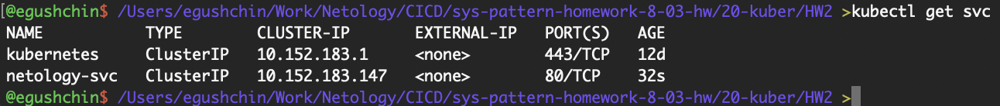
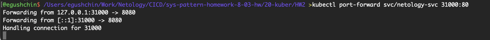
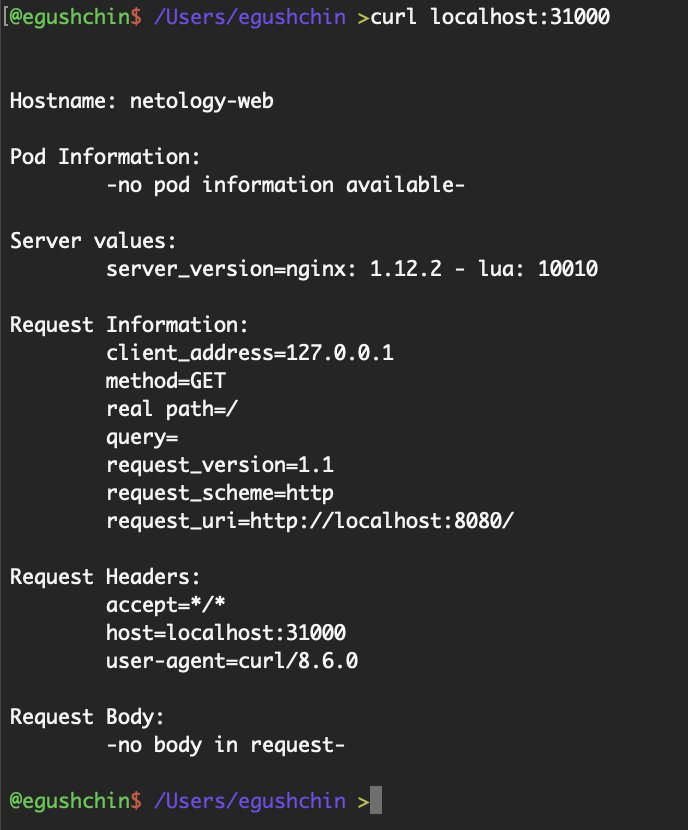

# Домашнее задание к занятию "`Базовые объекты K8S`" - `Гущин Евгений`

### Задание 1

1. Создал манифест [pod.yaml](./pod.yaml) с конфигурацией пода

2. Подключился локально к поду и проверил используя `curl`

  

  

### Задание 2

1. Создал сервис с именем netology-svc и с помощью селектора подключил netology-web
  

2. Подключился локально к сервису и проверил через `curl`
  

  

