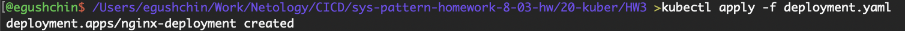
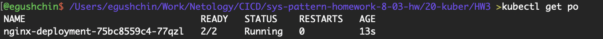
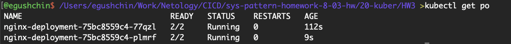
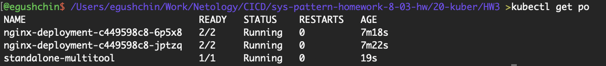
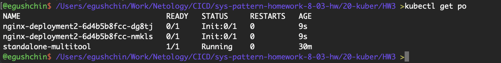
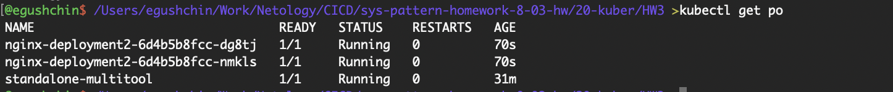

# Домашнее задание к занятию "`Запуск приложений в K8S`" - `Гущин Евгений`

### Задание 1

1. Создал Deployment с контейнерами nginx и multitoo [deployment.yaml](./deployment.yaml) 
из-за конфликта портов пришлось добавлять env переменную с указание порта

  

  

  

2. Увеличил количество реплик до 2

  

3. Создал сервис [service.yaml](./service.yaml) 

4. Создал отдельный под для multitool [multitool.yaml](./multitool.yaml) 
  

5. Подключился к поду и проверил из него доступ к приложениям
  

### Задание 2

1. Создал Deployment приложения nginx со стартом только после того, как будет запущен сервис этого приложения.
[deployment2.yaml](./deployment2.yaml) 

  

2. Создал сервис и запустил его [service2.yaml](./service2.yaml) 
Убедился, что Deployment стартанул

  

