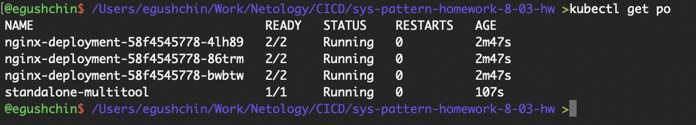
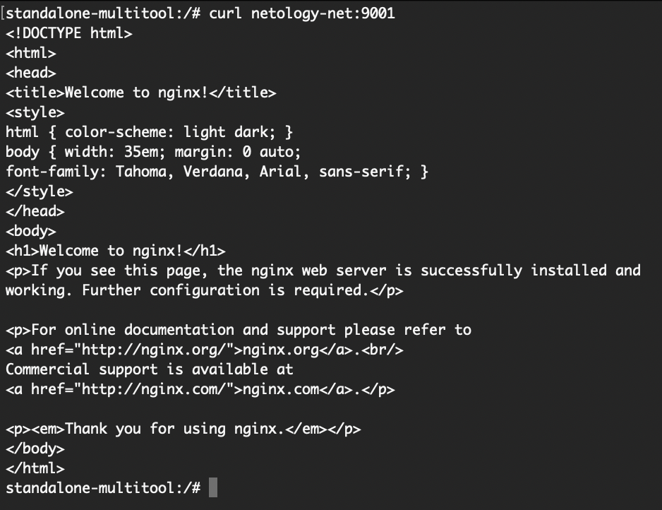
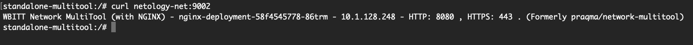
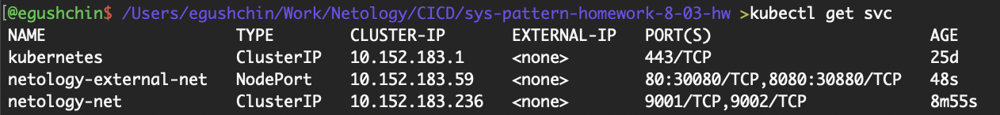
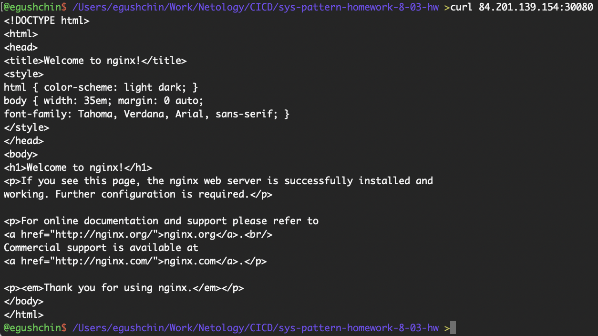
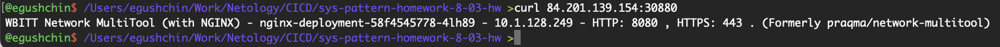

# Домашнее задание к занятию "`Сетевое взаимодействие в K8S. Часть 1`" - `Гущин Евгений`

### Задание 1

1. Создал Deployment с контейнерами nginx и multitool [deployment.yaml](./deployment.yaml) 
отдельный под с multitool [multitool.yaml](./multitool.yaml) 
сервис для доступа контейнерам [service.yaml](./service.yaml) 

2. развернул все поды и сервис

  

3. проверил доступ из пода `standalone-multitool` используя имя сервиса

  

  

### Задание 2

1. Создал отдельный сервис с типом `NodePort` [service_external.yaml](./service_external.yaml).

  

2. Проверил доступ к кластеру с локальной машины

  

  

