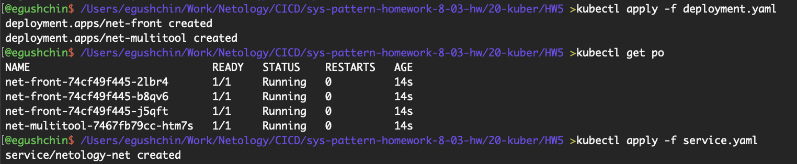
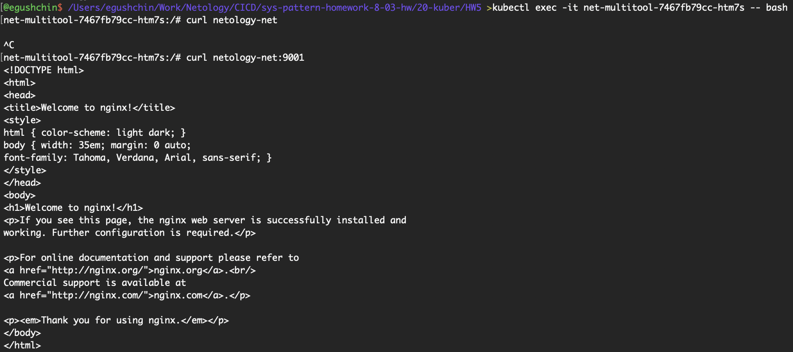
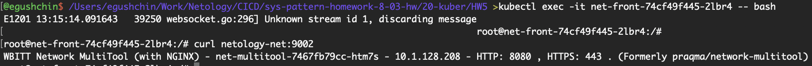
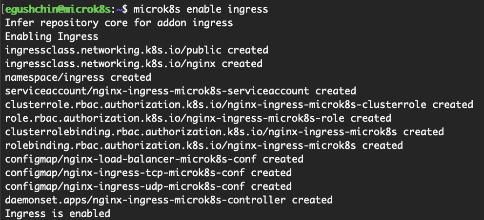
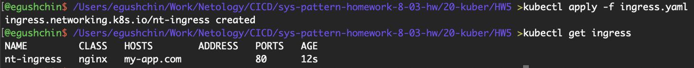
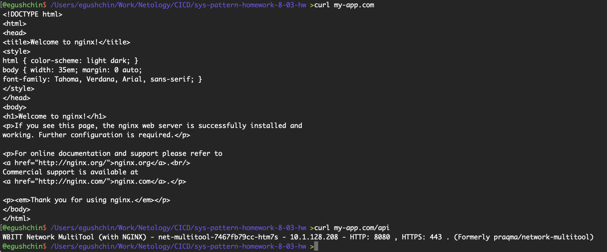

# Домашнее задание к занятию "`Сетевое взаимодействие в K8S. Часть 2`" - `Гущин Евгений`

### Задание 1

1. Создал Deployment с контейнерами nginx и multitool [deployment.yaml](./deployment.yaml) 
сервис для доступа контейнерам [service.yaml](./service.yaml) 

2. развернул все поды и сервис

  

3. проверил доступ из подов используя имя сервиса

  

  

### Задание 2

1. Включил Ingress-controller в MicroK8S:
  

2. Создал Ingress [ingress.yaml](./ingress.yaml).

  

3. Проверил доступ к nginx и multitool по доменному имени

  

