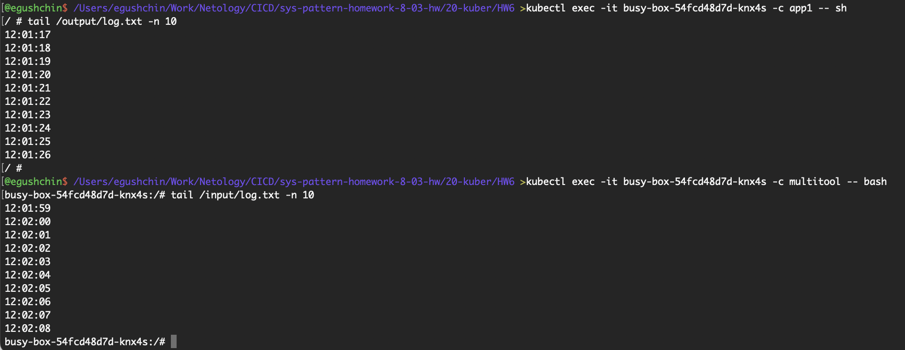
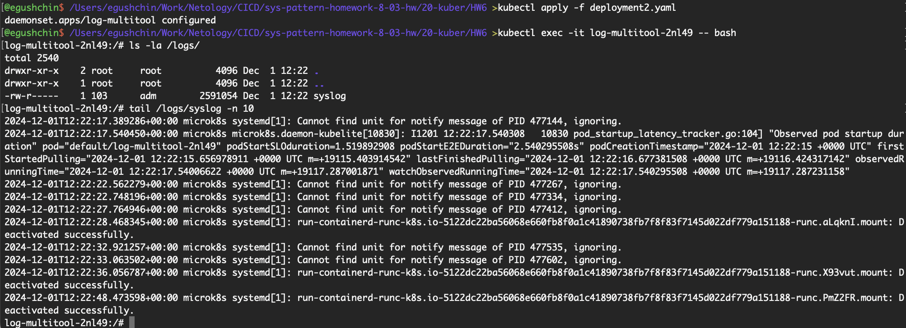

# Домашнее задание к занятию "`Хранение в K8s. Часть 1`" - `Гущин Евгений`

### Задание 1

1. Создал Deployment приложения, состоящего из контейнеров busybox и multitool. [deployment1.yaml](./deployment1.yaml) 

2. развернул поды и проверил, что busybox пишет в файл, а multitool может из него читать

  

### Задание 2

1. Создал DaemonSet приложения, состоящего из multitool [deployment2.yaml](./deployment2.yaml) 

2. настроил возможность чтения файла /var/log/syslog кластера MicroK8S

3. Проверил, что multitool может читать файл 

  

