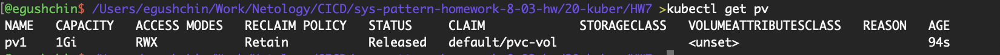

# Домашнее задание к занятию "`Хранение в K8s. Часть 2`" - `Гущин Евгений`

### Задание 1

1. Создал Deployment приложения, состоящего из контейнеров busybox и multitool. [deployment1.yaml](./deployment1.yaml)
Отдельно создал Persistent Volume [pv.yaml](./pv.yaml)

3. busybox пишет в файл, а multitool может его прочесть

  
  

4. Удалил Deployment. Статус PV поменялся на Released потому, что не осталось объектов, которые его используют.

5. файл сохранился на локальном диске ноды

Удалил PV, но файл остался на локальном диске потому, что:
- RECLAIM POLICY: Retain
- Так же возможно для данной версии PV *RECLAIM POLICY* Delete не поддерживатеся

### Задание 2

1. Создал Deployment [deployment2.yaml](./deployment2.yaml) и включил плагин *hostpath-storage*
2. Файл пишется и читается

