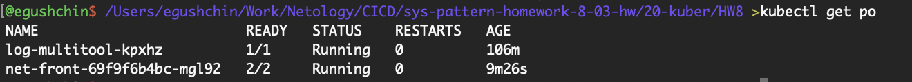
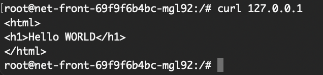
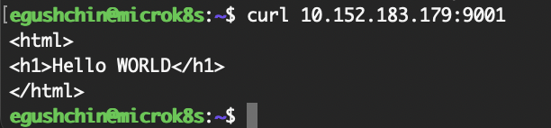
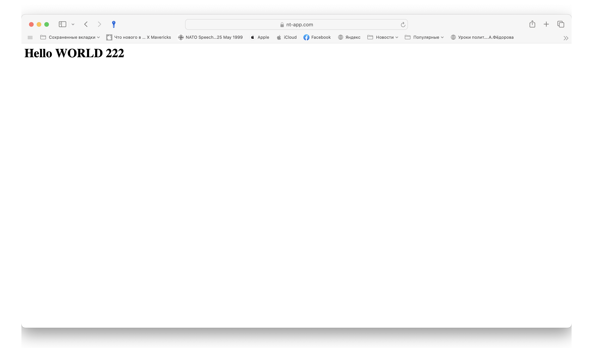

# Домашнее задание к занятию "`Конфигурация приложений`" - `Гущин Евгений`

### Задание 1

1. Создал Deployment приложения, состоящего из контейнеров nginx и multitool. [deployment1.yaml](./deployment1.yaml)

Так проблема с портами давно известна сразу создал Config Map [config1.yaml](./config1.yaml)

2. Запустил Config Map и Deployment. Проверил, что поды создались

  

3. Проверил, что отображается моя страничка
из пода 

с ноды

### Задание 2

1. Создал SSL сертификат [tls.crt](./tls.crtl) и ключ [tls.key](./tls.key) 
2. Создал и запустил
- ConfigMap [config2.yaml](./config2.yaml) 
- Secret [secret.yaml](./secret.yaml) 
- Service [service1.yaml](./service1.yaml) 
- Ingress [ingress.yaml](./ingress.yaml) 
- Deployment [deployment2.yaml](./deployment2.yaml)  

2. Проверил доступность сайта по https:

