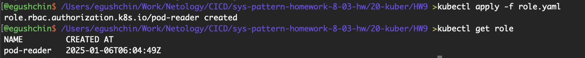

# Домашнее задание к занятию "`Управление доступом`" - `Гущин Евгений`

### Задание 1

1. Создал пользовательский сертификат

2. Создал пользователя, контекст и проверил, что контекст появился

  

3. Включил контроллер rbac

4. Создал роль [role.yaml](./role.yaml) 

5. Создал роль биндинг [rolebinding.yaml](./rolebinding.yaml) 

6. Переключил контекст и проверил, что доступно чтение списка подов и их логов

7. Также проверил, доступен ли пользователю user просмотр конфигурации пода

8. Проверил, что у польщователя нет прав на просмотр deployments и удаление подов

