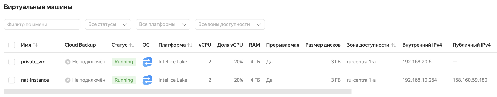
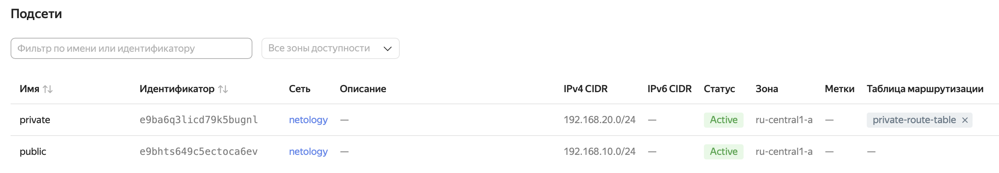
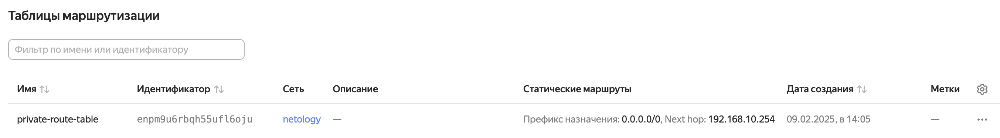
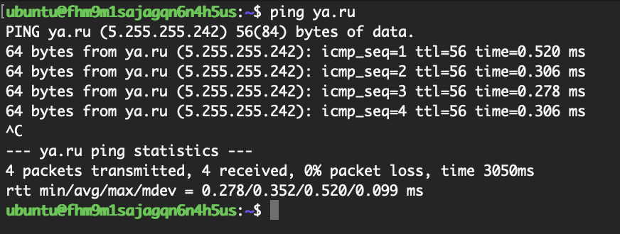
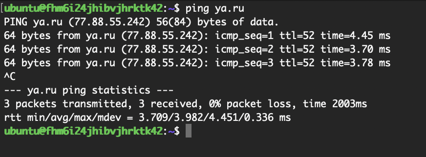

# Домашнее задание к занятию "`Организация сети`" - `Гущин Евгений`

### Задание 1

1. Согласно заданию создал 2 подсети, 2 виртуальные машины и таблицу маршрутизации
[террафом код здесь](./src)

2. Проверил доступность интернета с публичной ВМ

3. Проверил доступность интернета с приватной ВМ

