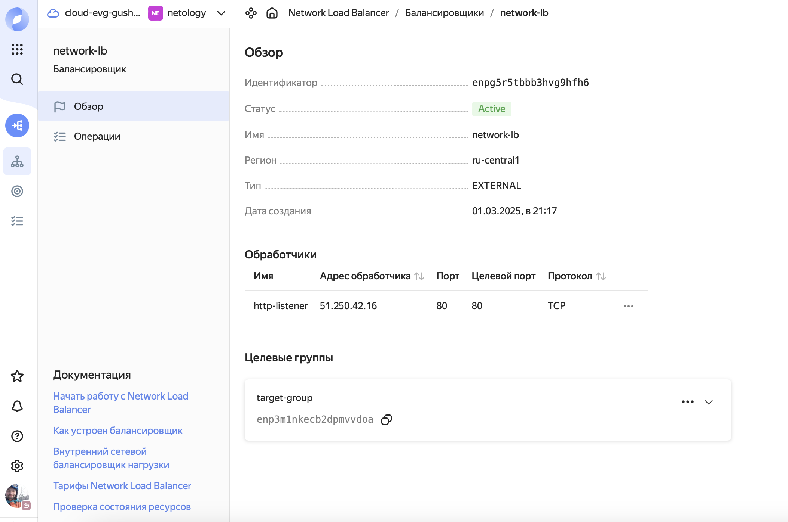

# Домашнее задание к занятию "`Вычислительные мощности. Балансировщики нагрузки`" - `Гущин Евгений`

### Задание 1

[террафом код здесь](./src)

1. Согласно заданию создал бакет Object Storage и разместил в нем картинку

2. Создал группу ВМ в public подсети фиксированного размера с шаблоном LAMP и веб-страницей, содержащей ссылку на картинку из бакета

3. Подключить группу к сетевому балансировщику

проверил доступ к машинам через балансировщик

при отключении одной машины, балансировщик перекинул трафик на вторую

