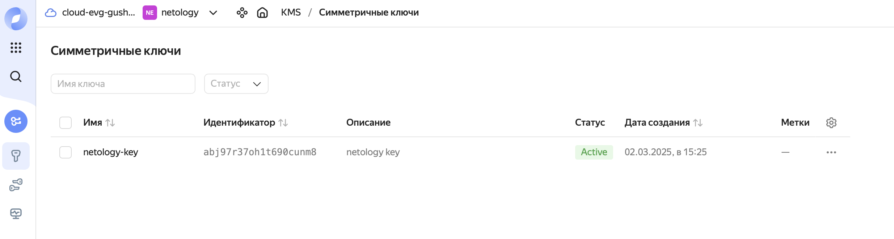
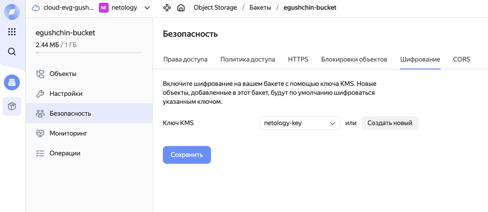
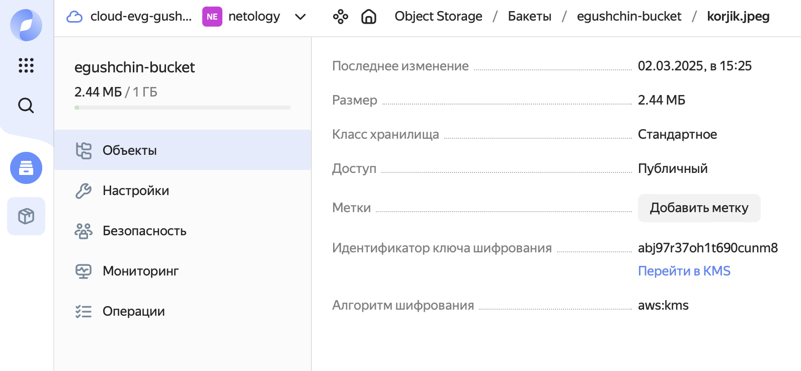
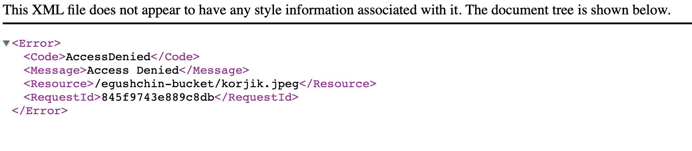

# Домашнее задание к занятию "`Безопасность в облачных провайдерах`" - `Гущин Евгений`

### Задание 1

[террафом код здесь](./src)

1. Cоздал ключ и зашифровал содержимое бакета:

Проверил, что файл зашифрован:

