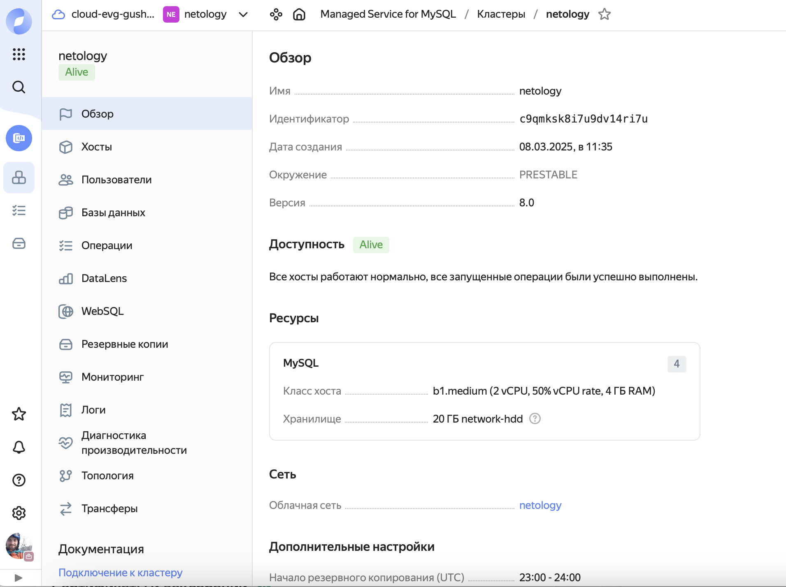
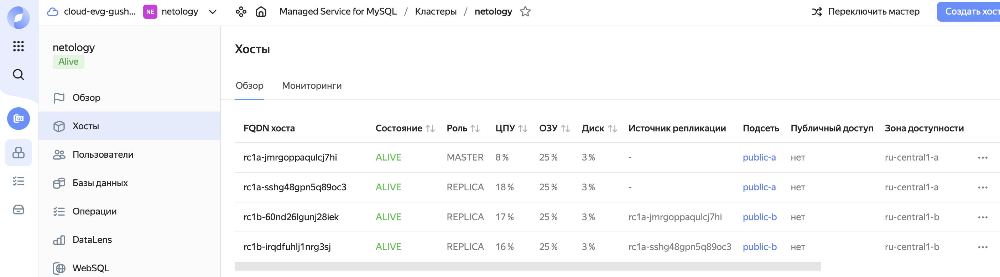
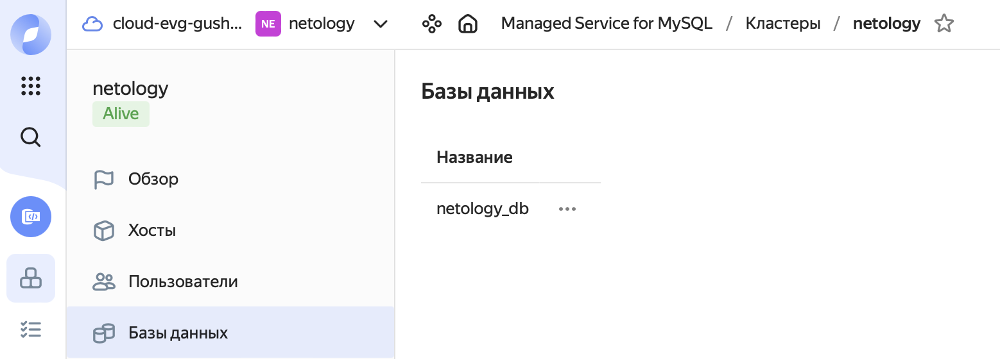
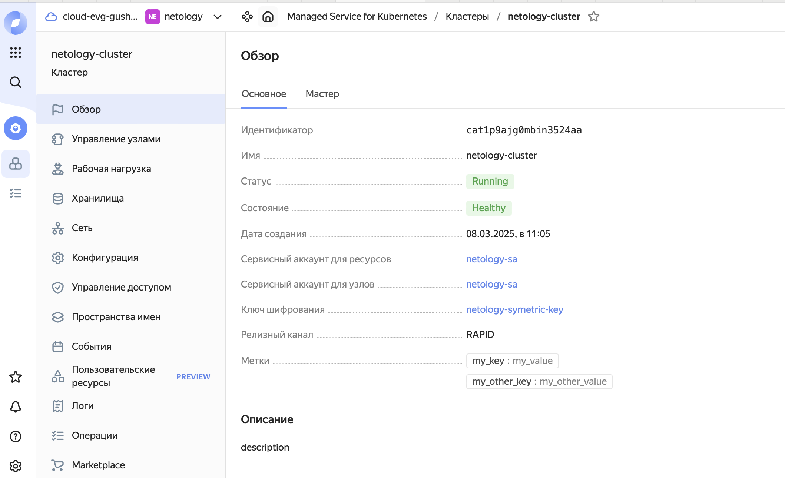
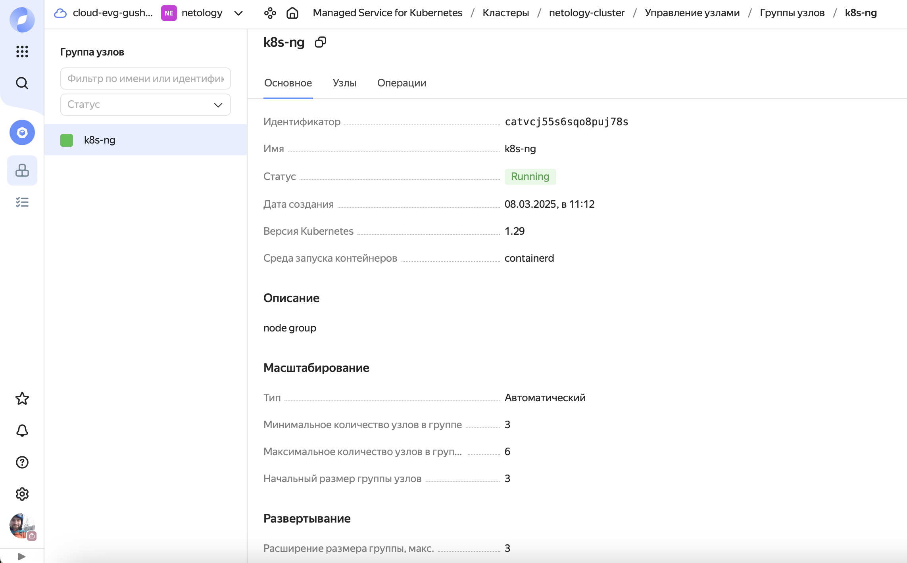
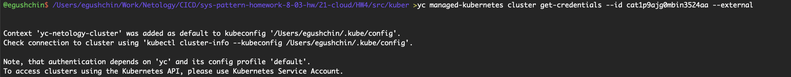
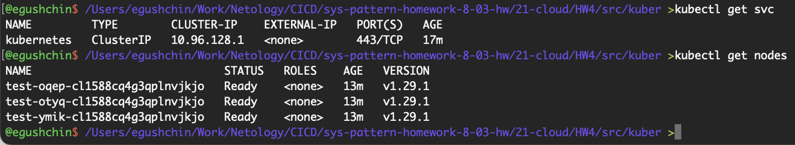

# Домашнее задание к занятию "`Кластеры. Ресурсы под управлением облачных провайдеров`" - `Гущин Евгений`

### Задание 1

[террафом код здесь](./src/mysql)

1. Создал кластер и Базу данных:

### Задание 2

[террафом код здесь](./src/kuber)

1. Настроил с помощью Terraform кластер Kubernetes

2. Получил учетные данные для подключения к кластеру

3. Подключился к кластеру

