# Дипломный практикум в Yandex.Cloud

## Цели:
   1. Подготовить облачную инфраструктуру на базе облачного провайдера Яндекс.Облако.  
   2. Запустить и сконфигурировать Kubernetes кластер.  
   3. Установить и настроить систему мониторинга.  
   4. Настроить и автоматизировать сборку тестового приложения с использованием Docker-контейнеров.  
   5. Настроить CI для автоматической сборки и тестирования.  
   6. Настроить CD для автоматического развёртывания приложения. 

## Этапы выполнения:
### Создание облачной инфраструктуры 

1. Создал сервисный аккаунт и бакет для хранения состояния
[tf-bucket](./tf-bucket/)

2. Подготовил backend для Terraform:
```
backend "s3" {
    endpoints = {
      s3 = "https://storage.yandexcloud.net"
    }
    bucket     = "diplom-bucket"
    key        = "diplom.tfstate"
    region     = "ru-central1"

    skip_region_validation      = true
    skip_credentials_validation = true
    skip_requesting_account_id  = true
    skip_s3_checksum            = true
    skip_metadata_api_check = true
}
```

3. Проинициализировал Terraform с использованием ключей от сервисного аккаунта
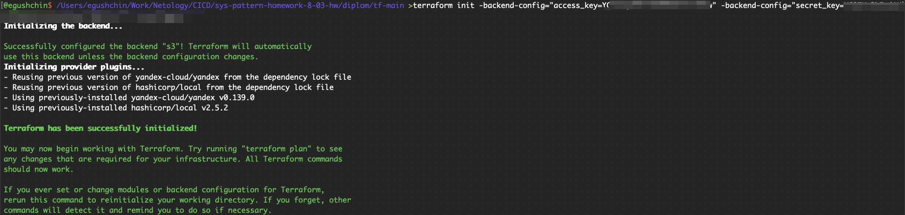

4. .tfstate записался в bucket
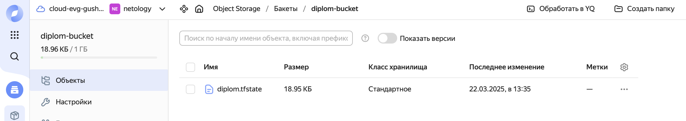

5. Написал скрипт для создания основной инфраструктуры для кластера [tf-main](./tf-main/):
- [ВМ](./tf-main/nodes.tf)
- [Сеть](./tf-main/network.tf)
- [Шаблон инвентори](./tf-main/hosts.tftpl)

6. После запуска `terraform apply` получил требуемую инфраструктуру

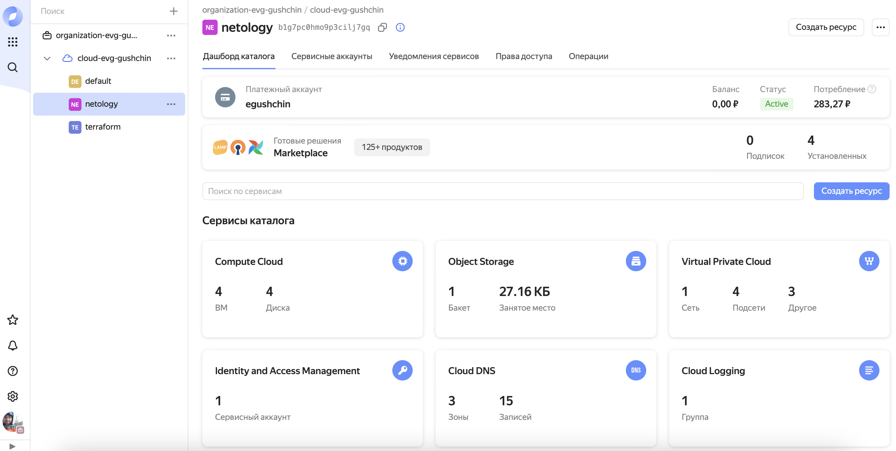

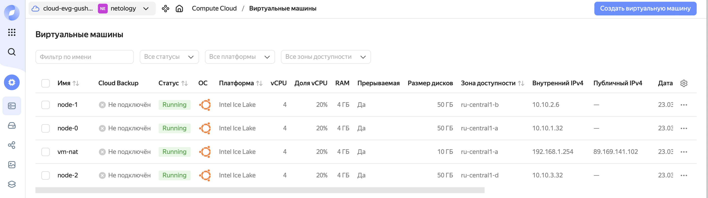

и инвентори файл для развертывания кластера

```yaml
---
all:
  vars:
    ansible_ssh_user: ubuntu
    ansible_ssh_private_key_file: ~/.ssh/id_ed25519
    ansible_ssh_common_args: '-o ProxyCommand="ssh -W %h:%p -q -o UserKnownHostsFile=/dev/null -o StrictHostKeyChecking=no "{{ ansible_ssh_user }}"@89.169.141.102 -i "{{ ansible_ssh_private_key_file }}""'
    become: true
    ansible_python_interpreter: /usr/bin/python3
  hosts:
    node-0:
      ansible_host: 10.10.1.32
      ip: 10.10.1.32
      access_ip: 10.10.1.32
    node-1:
      ansible_host: 10.10.2.6
      ip: 10.10.2.6
      access_ip: 10.10.2.6
    node-2:
      ansible_host: 10.10.3.32
      ip: 10.10.3.32
      access_ip: 10.10.3.32
  children:
    kube_control_plane:
      hosts:
        node-0:
    kube_node:
      hosts:
        node-1:
        node-2:
    
    etcd:
      hosts:
         node-0:
    k8s_cluster:
      children:
        kube_control_plane:
        kube_node:
    calico_rr:
      hosts: {}
```

### Создание Kubernetes кластера

Для развертывания кластера использовал *kubespray* и созданный на предидущем этапе инвентори файл.

1. Установил зависимости для *kubespray*:

```pip install -r requirements.txt```

2. Также в настройках поменял версию кубера с 1.31 на 1.30. Более свежая версия не хотела устанавливаться. Возможно надо поиграть с версиями *kubespray* и *ansible* 

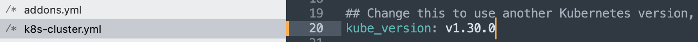

3. Добавил:
- [install.yml](./ansible/install.yml) для развертывания кластера
- [prepare.yml](./ansible/prepare.yml) для ожидания ВМ кластера
- [config.yml](./ansible/config.yml) работа с конфиг файлом после развертывания кластера

3. В [ansible.tf](./tf-main/ansible.tf) добавил шаг по запуску `ansible-playbook`
```
resource "null_resource" "installation" {
  depends_on = [
    local_file.hosts_templatefile,
  ]

  provisioner "local-exec" {
    command = "export ANSIBLE_HOST_KEY_CHECKING=False; ansible-playbook -i ../ansible/kubespray/inventory/mycluster/hosts.yaml -u ubuntu --become --become-user=root ../ansible/install.yml"
  }

}
```

4. После отработки Ansible, кластер установился
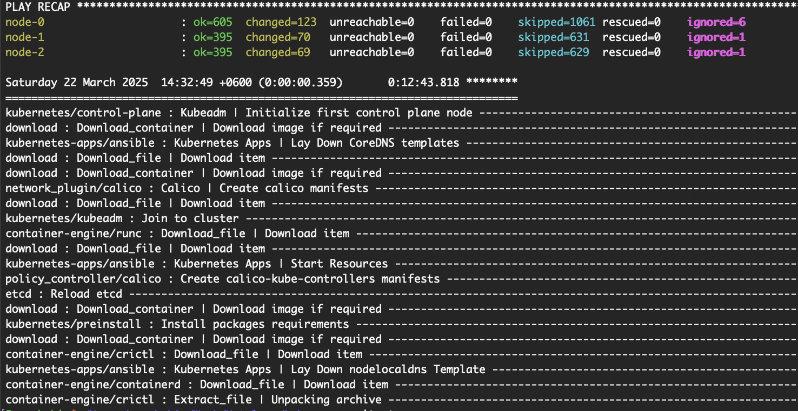

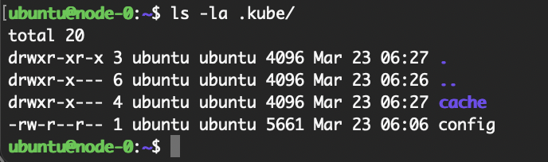
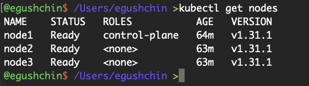
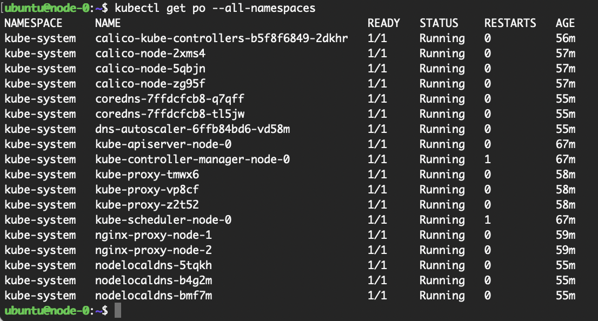

### Создание тестового приложения

1. Подготовил:
- [nginx.conf](./application/configuration/nginx.conf) 
- [index.html](./application/content/index.html) 
- [Dockrfile](./application/Dockrfile) 

2. В файле Докер пришлось указать платформу потому, что сборка шла на `arm64`, а запуск предполагается на `amd64`
```
FROM --platform=linux/amd64 nginx:latest 
```

3. Собираем образ из Dockerfile
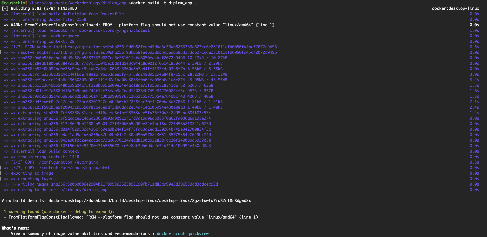

4. Проверил, что образ рабочий запустив его в контейнере

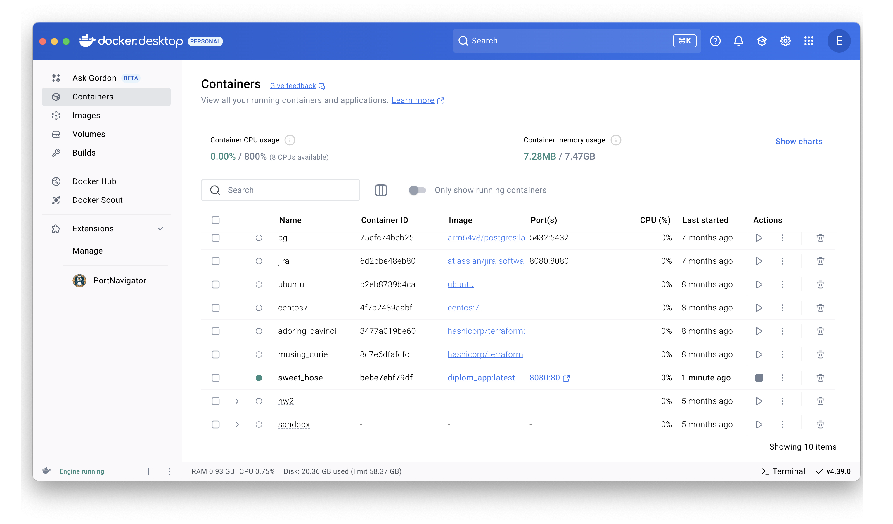


5. Запушил образ в Докер-Хаб

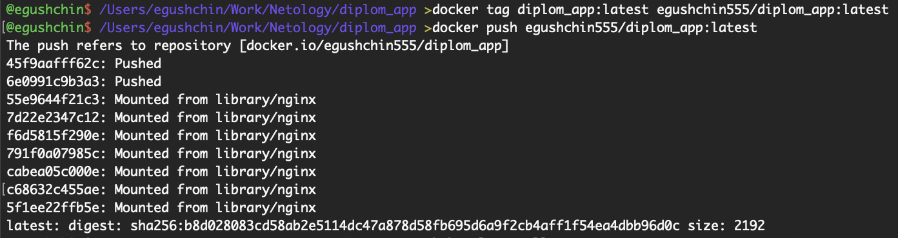

### Подготовка cистемы мониторинга и деплой приложения

1. Подготовил playbook для развертывания системы мониторинга
- [install-monitoring.yml](./ansible/install-monitoring.yml) 

2. Переопредил сервис и политики доступа к Grafana:
- [grafana-networkpolicy.yml](./ansible/grafana-networkpolicy.yml) 
- [grafana-service.yml](./ansible/grafana-service.yml) 

3. Для доступа к Grafana и проиложению из внешней сети создал [балансировщик](./tf-main/balancer.tf) 

4. Для деплоя приложения создал:
- [deployment для приложения](./ansible/app_deployment.yml)
- [сервис для приложения](./ansible/app_service.yml)
- [playbook для приложения](./ansible/deploy-app.yml)

5. Добавил в основной playbook задачи для развертывания систем мониторинга и приложения
```yml
---
- name: Prepare to install kuber cluster
  ansible.builtin.import_playbook: prepare.yml

- name: Install kuber cluster
  ansible.builtin.import_playbook: kubespray/cluster.yml

- name: Work with configs
  ansible.builtin.import_playbook: config.yml

- name: Install monitoring tools
  ansible.builtin.import_playbook: install-monitoring.yml

- name: Deploy app
  ansible.builtin.import_playbook: deploy-app.yml
```

6. После примения изменений `terraform apply` создался балансировщик

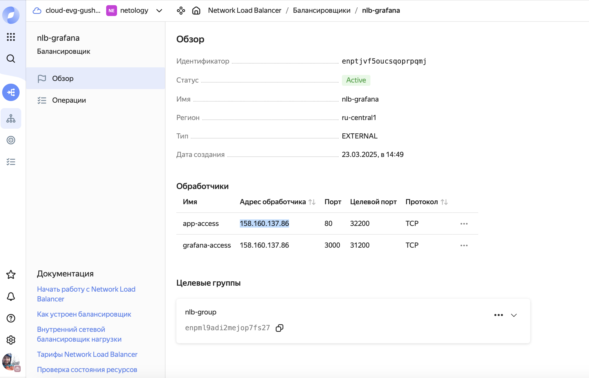

7. Через баласировщик получил доступ к Grafana и приложению

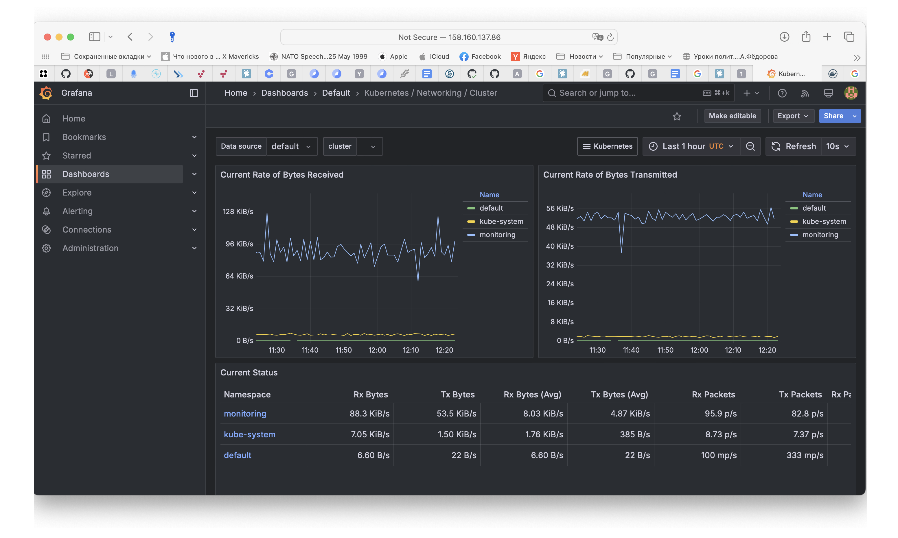


### Установка и настройка CI/CD

Для CI/CD использовал GitHub Action в [репозитории с приложением](https://github.com/EvgeniyGushchin/netology_sample_app). 

1. В репозитории приложения добавил секреты:
- DOCKERHUB_TOKEN
- DOCKERHUB_USERNAME
- KUBECONFIG

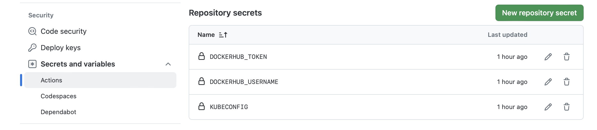

2. Создал workflow файл [ci-cd.yml](.application/.github/workflows/ci-cd.yml)

3. Так как кластер в приватной сети добавил баласнировщик для доступа к нему:
```
resource "yandex_lb_target_group" "nlb-k8s" {
  name = "nlb-k8s"
  target {
    subnet_id = yandex_compute_instance.vm-instance.0.network_interface.0.subnet_id
    address   = yandex_compute_instance.vm-instance.0.network_interface.0.ip_address
  }
}


resource "yandex_lb_network_load_balancer" "nlb-k8s" {
  name = "nlb-k8s"
  listener {
    name        = "k8s-access"
    port        = 32400
    target_port = 6443
    external_address_spec {
      ip_version = "ipv4"
    }
  }


  attached_target_group {
    target_group_id = yandex_lb_target_group.nlb-k8s.id
    healthcheck {
      name = "healthcheck-k8s"
      tcp_options {
        port = 6443
      }
    }
  }
  depends_on = [yandex_lb_target_group.nlb-k8s]
}
```

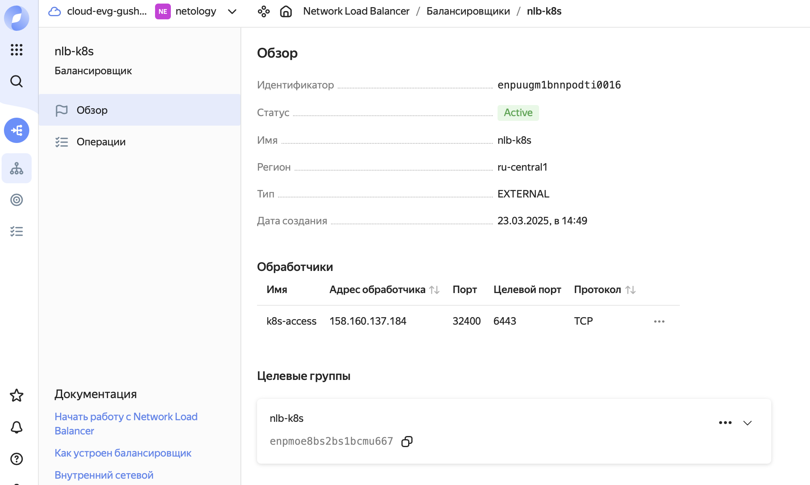

4. Также добавил этап изменения настройки кластера, чтобы ip балансировщика попадал в `supplementary_addresses_in_ssl_keys` кластера

```
resource "null_resource" "update_k8s_cluster_yml" {
  depends_on = [
    local_file.hosts_templatefile,
    yandex_lb_network_load_balancer.nlb-k8s,
  ]
  provisioner "local-exec" {
    command = <<EOT
      sed -i '' 's/supplementary_addresses_in_ssl_keys:.*/supplementary_addresses_in_ssl_keys: ["${one(one(yandex_lb_network_load_balancer.nlb-k8s.listener).external_address_spec).address}"]/' ../ansible/kubespray/inventory/mycluster/group_vars/k8s_cluster/k8s-cluster.yml
    EOT
  }
}
```

5. Проверил работу изменяя index.html
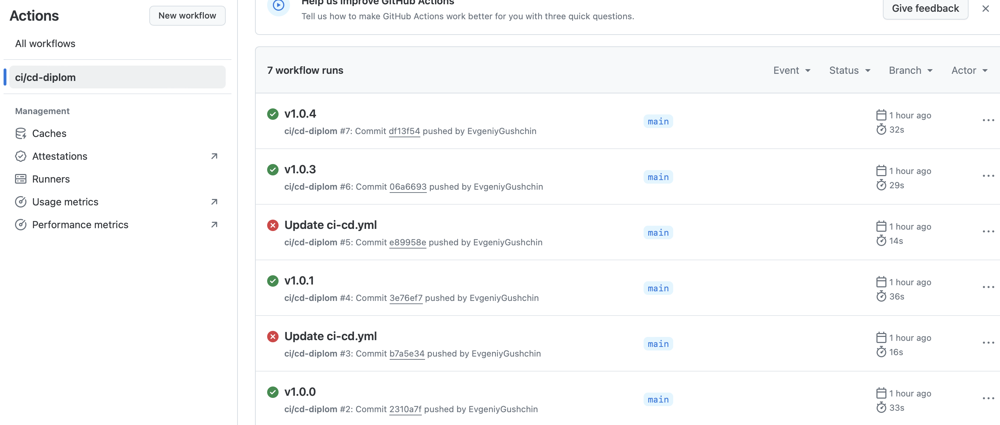

изменения автоматически публикуются

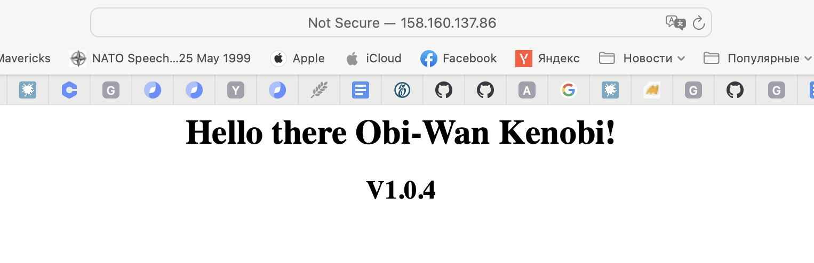